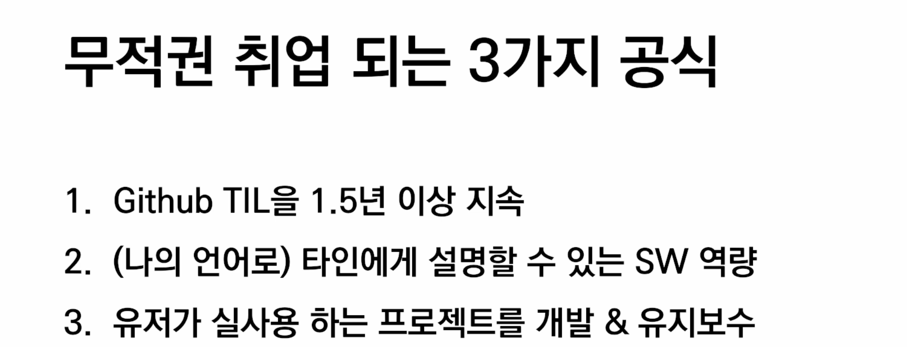
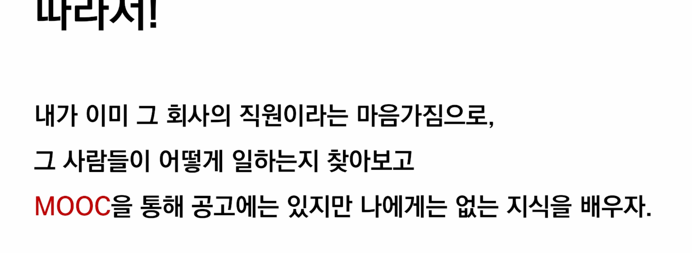

## 1. 9:00-10:00

---

#### 🧐포크 앤 풀 리퀘스트 하는 이유? 

> 소유하지 않아서!권한 없음 
>
> 1. 내것이 아니면 포크 찍어서 가지고 옴
> 2. 이제부터는 내 저장소를 관리하는 것과 동일(clone, add, commit)
> 3. 내 저장소로 push
> 4. GitHub 가서 PR

🧐머지 리퀘스트가 아니고 풀 리퀘스트인 이유?

> 해석하기 나름..내껄 가져가주세요?

🧐gitkeep,, gitignore쓰는 이유?

> gitkeep은 빈폴더를 만들기 위해서 > git 효율적으로 관리하기 위해
>
> Gitignore git 추적하지 않은 파일 관리 > git 모든 하위 디렉토리 파일을 추적하니까


## 2. 10:10-11:00

---

✔️다섯단계로 취업 특강 구성

1. 채용을 둘러싼 트렌드 분석(새로운 준비방법, 직군/직무 분석)
2. 서류전형
3. 온라인 코딩테스
4. 면접
5. 종합분석&준비


### 채용 트렌드

* 기술 생산과 기술 활용이 분리된다. (예전에는 생산한 기업에서 활용도함) > 커리어가 중요, 생태계/채용 시장 이해, 최신기술 동향 파악 중요

* **채용 시장 변화: 경력직의 시대 -> 공채 종말, 일자리가 줄진 않았음**

  > **역량 추정이 가능하기 때문, 즉시 투입 가능한 재원 확보 => 검증가능한 역량**
  >
  > **⭐️프로젝트가 중점임(ex.깃헙 tensorflow)⭐️** 

* **프로젝트 중심의 자기소개서, 자기를 소개하는 것이 아닌 자기가 한 것을 소개하는 것** 

  > **깃헙 활용이 너무나 중요함 => 개발자들의 이력서, 메모장 gyubin깃헙 참고** 
  >
  > **기업에서 깃헙을 꼭 봄**

  * **깃헙 활용방법**

    > **학습 -> 깃헙기록 -> 학습을 통해 무언갈 만들어냈다는 결과/프로덕트(연습용 습작) 중심 학습 -> 깃헙**
    >
    > **특정한 문제 해결한 프로덕트가 프로젝트 -> 깃헙**

  

  

## 3. 11:10-12:00

---

### 학습 공식 

>  공고에서 내가 가진 것을 빼면 내가 없는 것임, 그것을 학습하면 됨

🧠마인드셋

```
나는 이미 어떤 회사의 개발자이다! #당당해지기
어떤 회사의 개발자는 어떻게 일할까? # 이미 상상하기, 이미 무엇을 해야 될지 알기
현업 개발자의 관점!
그 회사사람이다! 
```


### 기업 내부 인력들이 학습하는 것

 ⭐️MOOC : 온라인으로 공개 된 오픈소스 

✔️`coursera` 가 대표적, edx등등
✔️유튜브 하버드 `edx cs50` 수업 추천(컴퓨터 개론) 

✔️`Udacity` 

* Cousera  | https://ko.coursera.org/
* edx      | https://www.edx.org/      
* udacity  | https://www.udacity.com/     
* K-mooc   | http://www.kmooc.kr/              
* udemy    | https://www.udemy.com/ko/         
* 생활코딩 | https://opentutorials.org/course/1 | -
*  cs50 (2021 가을 버전) 	https://cs50.harvard.edu/college/2021/fall/weeks/


## 3. 13:00-14:00

---

🔥할 수 있다! 포기하지 않기🔥




`이 기술을 갖고 어떤 문제(주변에 있는 문제)를 풀 수 있는 사람인지?문제를 발견하고 풀어나가는 것이 프로젝트 `

절대 혼자하는 것은 없음, 혼자 하는 일이 아니다, 각 분야에서 잘하는 사람이 있음





## 4. 15:00~16:00

---

실습 관련 내용 


## 17:00~18:00

---

TEST

