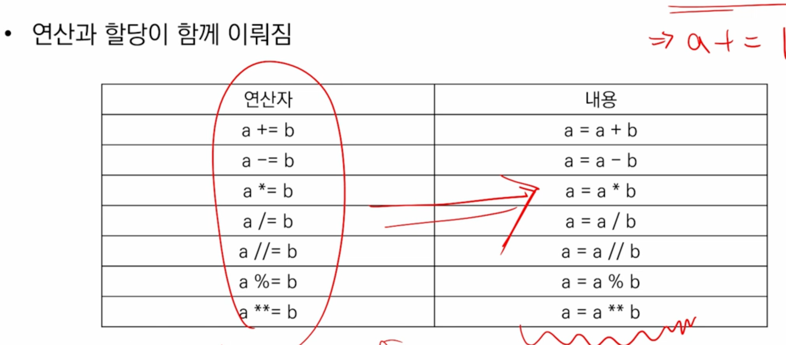
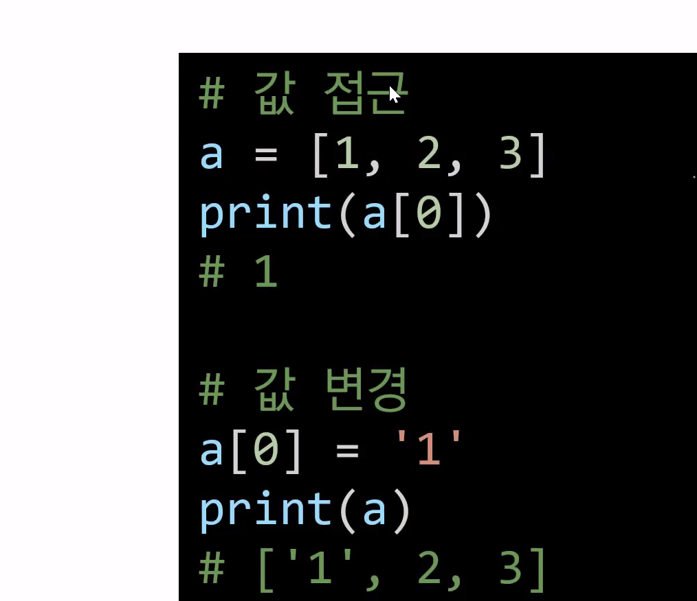
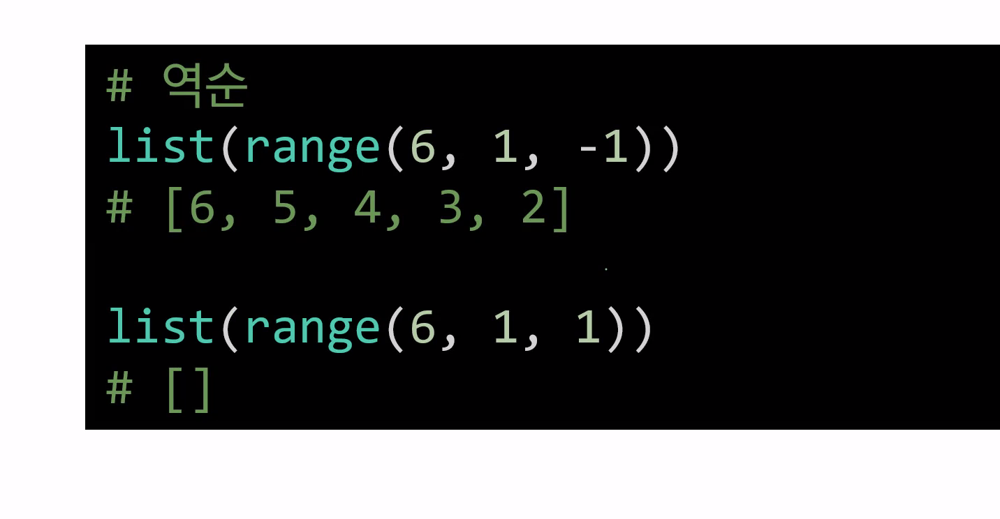
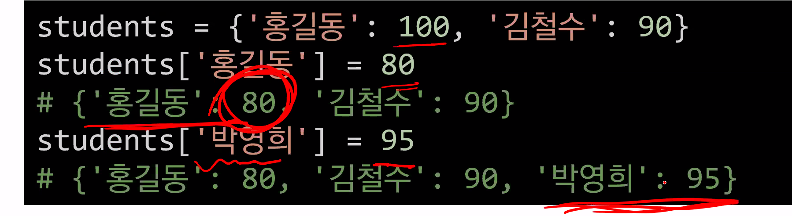
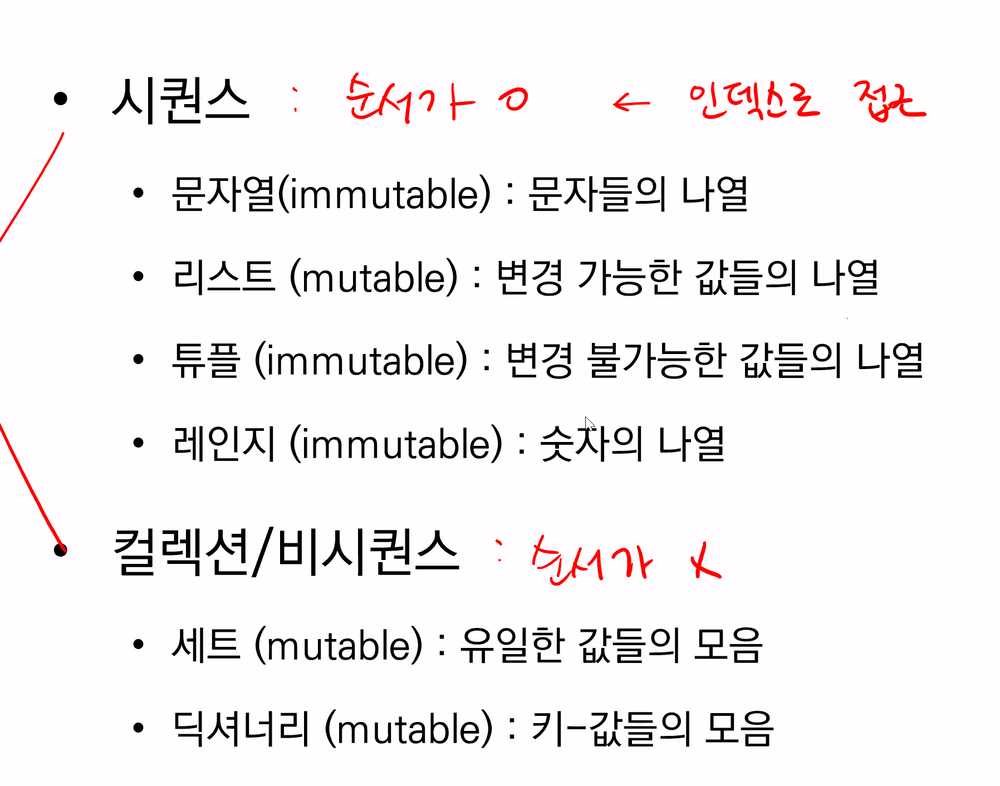

## 1. 9:00-10:00 

---

* 컴퓨터 프로그래밍 언어

  > 컴퓨터에게 자신의 생각을 나타내고 전달하기 위해 사용하는 체계
  >
  > 컴퓨터에게 명령하기 위한 약속

* 컴퓨터란? 

  > 계산을 하고 기억을 한다. 

* 프로그래밍이란? 

  > 명령어의 모음(집합)

* 언어란?

  >  자신을 생각하고 나타내기 위해 사용하는 체계

  

1. 선언적 지식

   > 사실에 대한 내용

2. ⭐️명령적 지식⭐️

   > How-to ; 어떻게 해야 할지 만들어나가야 함

### `목차`

```
* 파이썬 개발 환경
* 기초문법
* 자료형
* 컨테이너
```


* 파이썬이란? 

> 변수에 별도의 타입 지정 필요 없음 => 동적 타이밍 언어
>
> 문법 표현이 매우 간결함
>
> 코드를 대화하듯 한줄 입력하고 실행한 후, 바로 확인할 수 있음 => 인터프리터 언어
>
> 객체 지향 프로그래밍 언어 => 모든 것이 객체로 구현되어있음(객체란?~ `것` ex. 파이썬의 어떤 것, 물건, 대상)


### 파이썬 개발 환경

> 파이썬 스크립트 실행

✔️코드 스타일 가이드✔️

> 일관성있게 하자! 스타일 가이드를 잘 맞춰서 작성하자!
>
> ex. 프린트 들여쓰기, 따옴표/큰 따옴표 통일, = 띄어쓰기 


### 기초문법

> 문장 구분할 때 들여쓰기 사용
>
> 4칸 혹은 1탭을 입력하여 들여쓰기함

* 코드 작성하고 값이 나올 수 있지만, 값을 저장해놓고 활용할 예정 

* Print 사용하여 출력

  > vs의 파이썬 폴더에서 새로운 .py파일을 만듬 

* 변수라는 것에 할당하여 반복적으로 쓸 수 있음

* a 두개 변수 있는 경우, 뒤에 프린트 된 것 출력 => 위에서부터 아래로 실행 됨!!

* 오른쪽에서 왼쪽으로 봐야함!! 

* 변수란? 

  > a =8, 값을 저장 되어있는데 사용하기 위해 이름을 붙여놨다. 
  >
  > 동일 변수에 다른 것들을 할당할 수 있어서, 변수라고 불림
  >
  > 변수는 할당 연산자(=)를 통해 값을 할당
  >
  > * 타입: 숫자, 문자등 변수에 할당 된 값의 타입
  >
  >   > `텍스트 + 문자 변수` 가능함 

* 실습 문제 

  > ``` python
  > x, y = 10, 20 #x, y =10, 20일 때, 각각 값을 바드를 바꿔서 저장하는 코드를 작성하시오. 
  > x =10
  > y =20
  > tmp =x #임시 변수 활용(변수)
  > x =y
  > y =tem
  > 
  > y, x = x, y
  > print(x,y) #pythonic!
  > ```


## 2. 10:10-11:00

---

* 변수에 이름 규칙 

  > 영문 알파벳, 언더스코어, 숫자로 구성
  >
  > 첫 글자에 숫자가 올 수 없음
  >
  > 길이제한 없고, 대소문자 구별
  >
  > 특정 키워드는 예약어로, 사용할 수 없음
  >
  > 내장함수나 모듈등의 이름으로 만들면 안됨

* 사용자 입력

* 주석

  > #로 사용


### 파이썬 기본 자료형

* 문자

  * 따옴표가 중요, 작은 따옴표로 주로 사용하신다함

  * 따옴표 안에 따옴표를 표현한 경우

  * 삼중 따옴표는 작은 따옴표로 세개 표현하면 여러줄을 나눠 입력할 때 편리, 따옴표 안에 따옴표 넣을 떄

    ```python
    A = 5 #INT
    B = '5' #STR > 문자열
    
    #길이
    fruit = 'apple'
    print(len(fruit)) #5
    
    #접근
    print(fruit[1]) #p
    #컴퓨터에서는 숫자를 0부터 
    
    #슬라이싱
    print(fruit[1:3]) #b,c
    #인덱스 1이상, 3미만
    
    #마지막 값은 ? 
    #파이썬은 음의 인덱스도 가지고 있음
    print(fruit)
    print(fruit[-1]) #길이 -1 = 마지막 값
    
    
    ```

  * 인덱싱 : 인덱스를 통해 특정 값에 접근할 수 있음
    * s[1] => 'b'
    * s[-6:-2] => 맨 앞에가 문자열 길이의 - 이므로, -6~-3내 문자열 출력 
    * s[2:5:2] => step을 주는 것임 2~5까지 중 두칸 간격을 뽑아내줘. 
    * S[5:2:-1] => 5부터 23자리수까지 -1거꾸로 가 
    * S[:3] => 처음부터 3미만
    * S[5:] => 5부터 끝
    * s[::] => 처음부터 끝까지 1씩, 그대로 
    * s[::-1] => 뒤집기, 거꾸로 
  * 결합, 반복, 포함여부 확인할 수 있음(포함은 in)

* 수치

  * 모든 정수는 int

  * 정수가 아닌 모든 실수는 float => 알고리즘엔 거의 없음 

    * 3.3333e+99 => 소수점 뒤 99자리
    * -1e-100 => 0.----------1
    * 1e-1 => 0.1
    * 실수인 경우에는 소수점 끝에 1이 있을 수 있기 때문에 비교할 때, 실수할 수있음, a-b == 0으로 표현

  * 복소수 => 생각 no!

  * 산술 연산자

    *  `/` 나눗셈 : 
    *  `%` 나머지 : 짝수인지 홀수인지 확인하기 위해서 많이쓰임!! 2의 배수 2로 나눴을때 0,1
    *  `//` 몫
    *  `**` 거듭제곱

  * 복합연산자 

    

  * 비교연산자 

    

* 불린 : `참, 거짓`

  > 컴퓨터는 0, 1만 하는 것인데 이와 비슷하게 트루1, 펄스0만 사용함
  >
  > 비교/논리 연산 수행
  >
  > > 논리연산자는 논리식을 판단하여, t,f반환함
  > >
  > > And: 둘다일 경우에만 트루 
  > >
  > > or: 둘중 하나만 참이라도 참, 그렇지 않으면 거짓
  > >
  > > Not: 참, 거짓의 반대 결과
  >
  > 특정 데이터가 T,F인지 검증

  

* None

  > 값이 없음을 의미


## 3교시 11:10-12:00

---

### 문자열 활용

```python
#역슬래시 활용
#개행, 줄 바꿈
print('안녕하세요, \n반갑습니다')

#따옴표안에 따옴표를 쓰고 싶을 때
print("따옴표를 '씁니다'")
print('따옴표를 \'씁니다\'') #둘다 같음, 역슬래시를 각 따음표 앞에 써줌

#역슬래시 사용하고 싶을때? 역슬래시 두번 사용
print('escape sequences는 역슬래시 \\를 사용한다.') #escape sequences는 역슬래시 \를 사용한다.출력

#문자열 안에 변수 넣기 
score = 100 

#내 점수는 100이야. => #숫자여서 오류 발생 
print('내 점수는' + score + '이야')
print(f'내 점수는 {score}이야') # f string 사용

#숫자와 문자는 더할 수가 없어서 직접 문자열로 변환! 
print('내 점수는'+ str(score)+'이야')

#리스트 -> 약통처럼 각 값을 한통에 담음, 리스트 안에 리스트를 넣을 수 있음
#리스트는 값들의 나열/시퀀스, 순서로 접근!
students = ['동현', '다겸']
print(students[0]) #동현
print(students[-1]) #다겸, 마지막 출력

students = [['동현'], ['다겸']] #리스트 내 리스트는 회차 정보를 담으려했으나, 담을 수 없음

#딕셔너리
#키-값의 쌍이므로, 접근할 떄 키로 접근, 요일별 약통
studenets = {'1회차': ['동현'], '2회차': ['다겸']}
print(students['1회차']) #1회차 학생을 보고싶을 때
```


* f를 붙이고 중괄호를 넣으면 무적임, 소문자 f 여야함
* 문자열 반복 가능
* 문자열 ?를 !로 변경 불가 


### 자료형 변환

* 데이터 형태에서는 서로 변환할 수 있음 

* 암시적 

  * 사용자 의도하지 않고 파이썬 내부적으로 자료형 변환하는 경우
  * 숫자 더하는 것
  * 트루를 1로 바꾸는 것

* 명시적

  * 숫자 제외 직접 바꾸어야함
  * 문자열을 숫자로 
    * int(숫자), float(실수)

  * 다른 것을 문자로 
    * str : 따옴표만 찎어주면 되긴함

### 컨테이너

* 여러개를 담는다. 

* 주로 활용되는 컨테이너

  * `리스트`
  * `딕셔너리`

* 시퀀스 : `순서가 있는 것` `인덱스로 접근`

  * 문자열
  * 리스트
  * 튜플
  * 레인지

* 컬렉션/비시퀀스 : `순서가 없는 것`

  * 세트
  * 딕셔너리 : 키로 접근

  

## 4교시 13:00-14:00

---

 ### 컨테이너

1. 시퀀스

* 인덱싱 s[i]
* 슬라이싱 s[i:j],, s[i:j:k]
* 이어붙이기 s +t
* x in s : s가 포함되어있으면 T

```python
print([1,2]+[3]) #[1,2,3]
```

* 리스트

  > 변경 가능한 값들의 나열된 자료형
  >
  > 순서를 가지며, 서로 다른 타입의 요소를 가질 수 있음
  >
  > 변경 가능하며, 반복 가능함
  >
  > 대괄호 형태로 정의하며, 요소는 콤마로 구분
  >
  > 
  >
  > 
  >
  > 
  >
  > * .append() 맨 뒤에 추가 
  >
  > * .pop() 삭제하고자 하는 인덱스를 전달
  >
  > * ```python
  >   boxes = ['banana']
  >   boxes[1][0] #'b'
  >   ```

* 튜플: 리스트와 똑같지만 `값 변경 불가` 

* 레인지: 숫자의 순서를 독특하게 나타내는 것, `범위 지정`

  * Range(3) => 0,1,2
  * Range(1,4) => 1,2,3
  * Range(1,5,3) => 1,3

  ```python
  numbers = range(5)
  #리스트 변환해서 보면 편함
  #실제로는 range 로 씀
  print(list(numbers)) # [0,1,2,3,4]
  
  ```

  

​	

2. 세트 : 유일한 값들의 모음

   * 중괄호 혹은 set()를 통해 생성

   * 빈중괄호는 딕셔너리

   * 내부적으로 표현만 똑같이하는 방법이 있을 뿐, 순서가 없음!! 

   * 리스트에서 고유한 지역의 개수를 알고 싶을때 사용하면 좋음

     * 활요예시

       ```python
       locations = ['서울', '서울', '대구']
       print(set(locations)) #중복 된 것 제거
       print(len(set(locations))) #6
       ```

   * 다른 컨테이너에서 중복 된 값을 쉽게 제거할 수 있음

3. 딕셔너리

   * 키와 값의 쌍으로 이뤄진 모음

   * 키: 불변 자료형만 가능**(리스트, 딕셔너리 불가)**

   * 값 : 어떠한 형든 과계없음

   * 딕셔너리에 키와 값의 쌍을 추가할 수 있으며, 이미 해당하는 키가 있다면 기존 값이 변경 됨

     

   * 키를 삭제하고자하면 pop을 활용하여 삭제하고자 하는 키를 전달
   * 키가 없는 경우는 keyerror 발생

   

## 5교시 14:05-15:00

---




### 쪼개기 Split

```python
a = '1 2 3'
# ['1', '2', '3']
# 문자열을 특정 단위로 쪼개줌!
# 리스트!
print(a.split())
```

