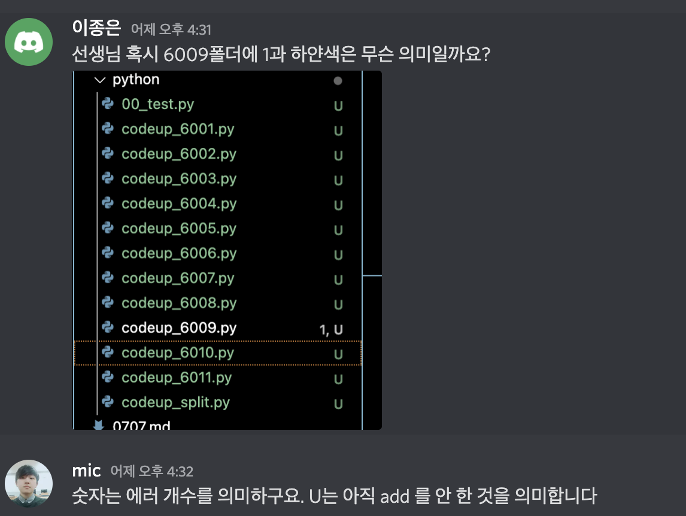
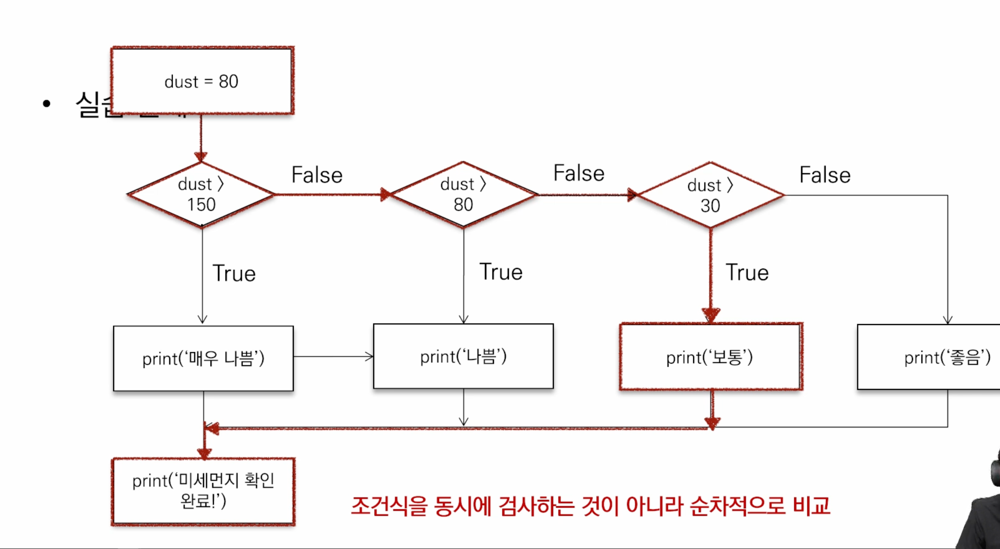
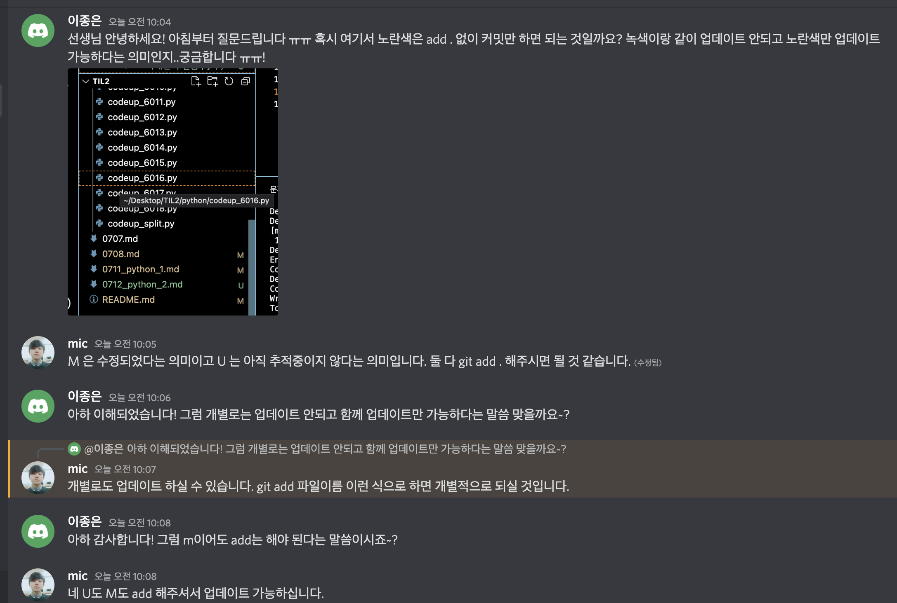
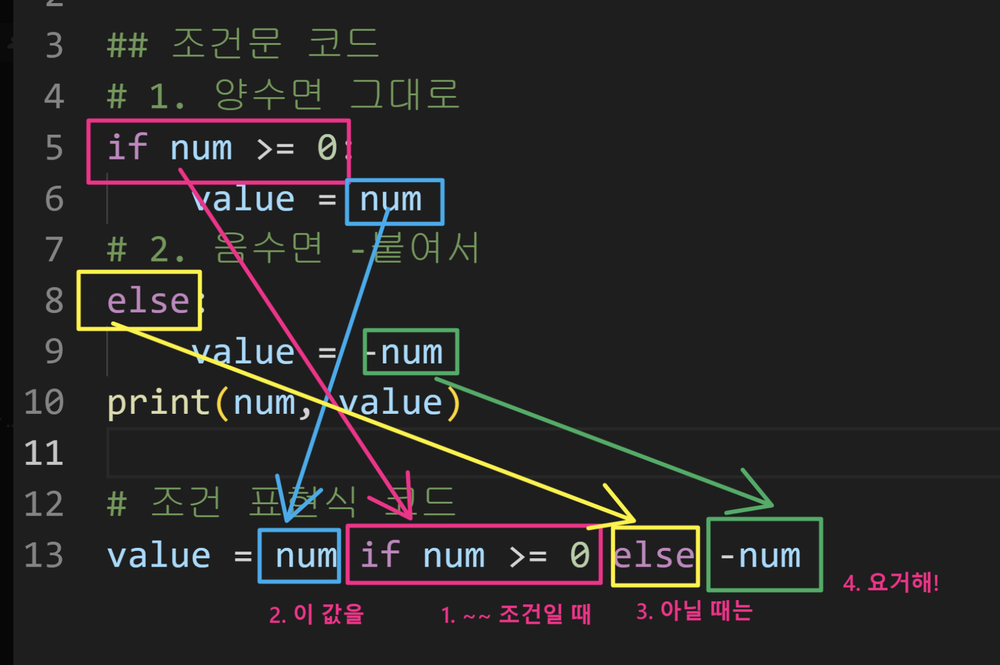
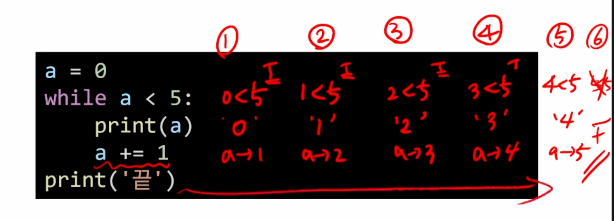
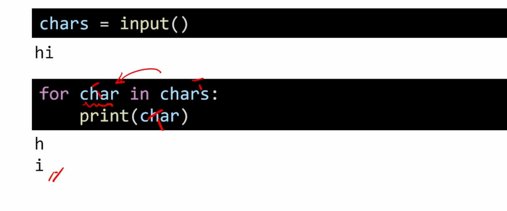
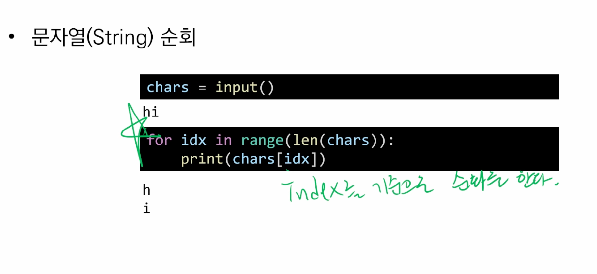
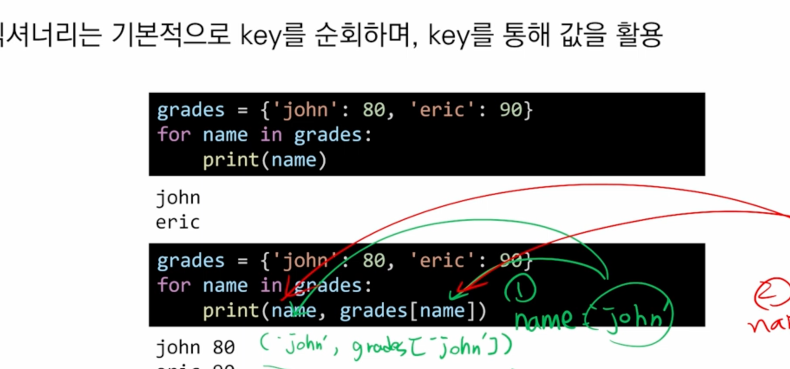
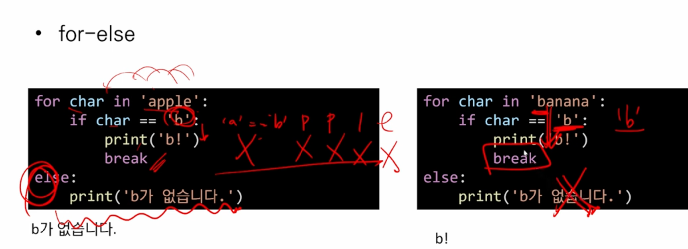
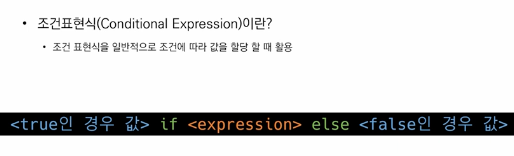

## 1교시 9:10-10:00

---

✔️어제 배운 것 정리



* 문자열 : 인덱스로 접근 가능, 반복 가능 
* 숫자열
* 불린형
* None

1. 시퀀스 : 리스트, 튜플, 레인지
2. 컬렉션 : 순서 없는 것 

### 오늘 학습 목표

#### 제어문

> 위에서부터 아래로 순차적으로 명령을 수행
>
> 특정 상황에 따라 코드를 선택적 반복적으로 실행 

1. 조건문 

   > 참/거짓을 판단할 수 있는 조건식과 함께 사용
   >
   > 위에서부터 아래로 실행되지만 트루인 경우 트루블럭만 실행 됨 
   >
   > 거짓인 경우에는 esle인 부분만 실행 됨 
   >
   > **기본형식 : if < 조건 > :**
   >
   > **네칸 들여쓰기 <코드블럭> <-참일때**
   >
   > **Else:**
   >
   > **네칸 들여쓰기 <코드블럭> <-거짓일 때** 

   * 홀수를 확인하는 코드는? 조건문을 통해 num의 값의 홀수/짝수 여부를 출력하시오.

     ```python
     num = int(input()) # num은 input으로 사용자에게 입력을 받으세요. 
     print(num, type(num)) #type 확인
     if num % 2 == 1: # 조건문을 통해서 홀수/짝수 여부를 출력하세요.
       print('홀수')
     else:
       print('짝수')
     ```

     🧐타입에러 나오면 타입을 봐야함, 기본 문자열임 

   * 복수 조건문

     * 복수의 조건식을 활용할 경우 elif를 활용하여 표현함

       ```python
       #미세먼지 농도에 따른 등급일 떄, dust값에 따라 등급을 출력하는 조건식
       dust = 100
       # dust가 150보다 크면, 매우 나쁨
       if dust > 150 :
           print('매우나쁨')
       # 80보다 크면, 나쁨
       elif dust > 80:
           print('나쁨')
       elif dust > 30:
           print('보통')
       #좋은
       else:
           print('좋음')
         
       ```

       ⚠️ **elif 쓰다보니 else에도 조건 추가하는 경우가 있으나, else는 위의 모든 조건에 해당하지 않는 나머지의 경우이기에 별도 조건 불가능!! 주의!!** 

       ⚠️else는 필요에 따라서, 반드시 있을 필요는 없다. 생략 가능

       ⚠️위에서부터 아래로 실행하는데, 하나씩 테스트함

       

       * 중첩 조건문

         * 조건문은 다른 조건문에 중첩되어 사용 될 수 있음

           * 들여쓰기를 유의하여 작성할 것

           ```python
           dust = -10
           if dust > 150:
             if dust >300: #중첩조건문
               print('실외활동 자제') 
             print('매우나쁨') #여기서 else를 넣어주면 동시에 안뜨고 둘중에 하나만 뜸, 같이 출력 원하기 때문
           elif dust > 80if dust > 150 :
               print('매우나쁨')
           # 80보다 크면, 나쁨
           elif dust > 80:
               print('나쁨')
           elif dust > 30:
               print('보통')
           #좋은
           else:
             if dust < 0: #중첩조건문
               print('음수 값입니다.')
              else
               print('좋음') #여기서는 둘중 하나만 떠야하기 떄문에 else 넣어줌
           ```

           

2. 반복문




## 2교시 10:00 - 11:15

---

### 조건 표현식 코드

> ```py
> # 조건표현식 코드$
> value = num # 참일 경우
> if num>=0 조건
> else -num #거짓일 경우 
> 
> # 절댓값 코드 
> num = -10
> if num >0:
>   value = num
> else:
>   value = -num
>  print(num, value)
> ```

✔️규칙 숙지✔️

1. ~조건일떄, 2. 이값을 3. 아닐때는 4. 요거해! 

2. 

   

### 반복문

> 특정 조건을 도달할 때까지, 계속 반복되는 문장

1. while문

   * **종료조건에 해당하는 코드**를 통해 반복문을 종료시켜야함

   * 조건식이 참인 경우 반복적으로 코드 실행 -> 무한실행

   * 실행되도록 만들어놓고 값이 계속 바뀌면서 조건이 변하여 f인 경우 실행안되도록

   * 조건이 참일 때까지 코드 블럭 계속 실행

   * a += 1 => a = a+1과 동일

     

     * 실습문제 > `다시보기`

       * 1부터 사용자가 입력한 양의 정수까지의 총합을 구하는 코드 작성

         * 설계 먼저 ! 1부터5까지 더하는 것 어떻게 할까? 
         * n이 1씩 증가, result에는 n을 더해야함, 종료는 n이 user_input 보다 커지면 종료(=작거나 같을 때까지)

         ```python
         #처음 시작 값 
         n = 0
         # 0부터 더하기 위해서 
         Result = 0
         # user_input 값
         user_input = int(input())
         
         
         ```

         

2. For문

   * 반복가능한 객체를 모두 순회하면 종료, 별도 종료조건 필요 x

   

## 3교시 11:10-12:00

---

### For문

> 시퀀스(문자,튜플,리스트,레인지)는 for문으로 순회가능한 객체

* 통에 있는 물건을 한개씩 모두 꺼내서 변수안에 넣어주는 것이 목표 

* 처음부터 끝까지 모두 순회하므로, 별도의 종료조건이 필요하지 않음

* 전부 다 반복하는 경우 for 문 선언

* 문자열 순회

  * 사용자가 입력한 문자를 한글자씩 세로로 출력

    

* range를 활용하여 한글자씩 출력?  > 알고리즘 때 좀 더 많이 활용

  * 100글자 짜리 범위 설정은

  * ````python
     for idx in range(len(chars))
       print(chars[idx])
    ````

  * 

*  심화-enumerate

  * 인덱스 값이랑 일반 리스트 값을 묶어줌
  * 튜플 (0,'민수')
  * 첫번째 코드가 할당 된 코드라고 보면 됨 

* 딕셔너리 순회

  * 딕셔너리는 기본적으로 키를 순회하며, 키를 통해 값을 활용

    

  

  * 반복문 제어

    * Break : 반복문 종료
    * continue : 컨티뉴 이후 코드 블록은 수행하지 않고, 다음 반복문 수행
      * `다시보기`
    * For-esle : 끝까지 반복문 실행한 이후에 else실행
      * else문은 브레이크로 중단되었는지 여부에 따라 실행
      * 

    

### while문 for문 차이점 : 종료조건

* 조건문

  * if

  * Else :  나머지 의미, 선택적, 직접 조건 못줌

    * if, elif, else 이렇게 쓸 수 있음

  * 조건 표현식: 값을 조건에 따라 할당하려고 할 때(설탕 쳐놓는 것이랑 비슷)

    

* 반복문

  * while

    * while 조건이 참일 때까지 실행, 거짓으로 바뀌는 순간 실행되지 않음
    * 참이었다가 거짓이 되는 형태로 코드 작성 필요 

  * for

    * fot 변수이름_ in _반복 가능한 : 반복 가능한 아이를 처음부터 끝까지 꺼내준다. 
    * 그냥 쓰면 요소들이 나오고, range로 쓰면 인덱스로 접근함
    * 딕셔너리 경우에는 기본이 키다. 

  * 반목문 제어

    * 브레이크 : 종료
    * 컨티뉴: 다음 시행
    * for ese: 모든 반복을 하게 되면 실행을 시켜줌

    

    ## 4교시 13:00-14:00

    ----

    * 노션 실습문제 풀기

    