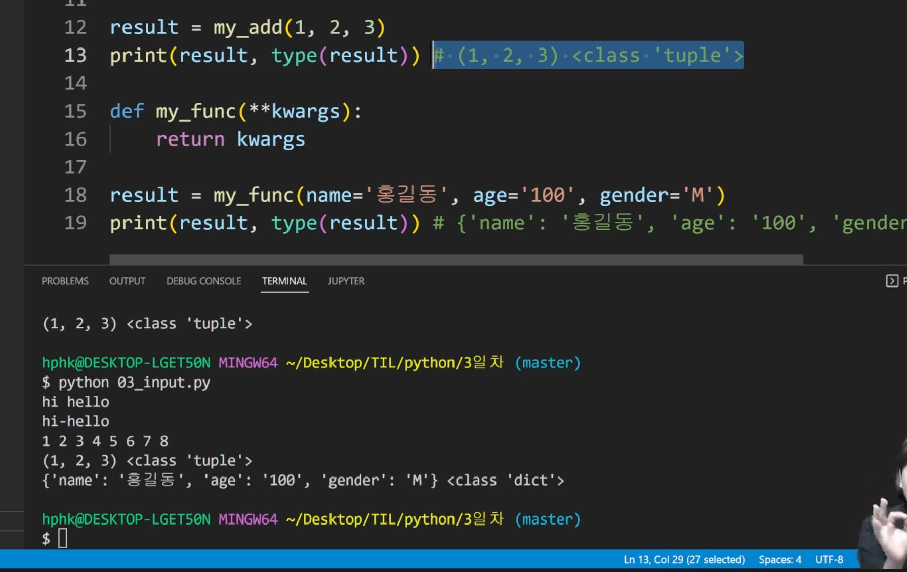

## 1. 9:00 - 10:00

---

### 이전 내용 복습

* 오전시간 : 이론
* 오후시간 : 실습
* for char in word에서 Char 변수란? 
  * 값에 이름을 달아주는 것, 값 하나씩! 들어가는 것 
  * 


* for 문은 변수의 갯수만큼 한번 순회하는 것, 멈추고 싶을때는 브레이크, 뒤에꺼 안하고 다음으로 넘어가고 싶을 때 컨티뉴
  * 초콜릿통 다 들이 부으면 끝남
* while은 멈추는 조건식 없으면 계속 반복
  * 숫자를 하나씩 세다가 특정 숫자를 말하면 멈춰! > 종료 조건이 중요!


### 함수

* 컴퓨터는 조작,계산하고 저장한다. 
* 명령적 지식 - 하우 투가 중요
* 변수와 타입
* 함수 사용하는 이유? 
  * 파이썬 내장 함수
  * 기능을 분해, 재사용 가능
  * 복잡한 내용을 숨기고, 기능에 집중하여 사용(블랙박스)
  * 변수(통): 데이터들이 많은데 데이터들에 이름 붙여서 사용
* 인풋을 넣으면 아웃풋을 줄께!


## 2교시 10:10~ 11:00

---

* 함수

  * 특정한 기능을 하는 코드의 조각,묶음
  * 파이썬 자습서 참고

* 함수 사용해야 하는 이유? 

  * 코드 중복 방지, 재사용 용이

* 인풋, 아웃풋, 몸통에 해당하는 코드를 직접 작성

* 함수 선언은 `def` 를 활용함

* 들여쓰기를 통해 실행 된 코드 블록 작성함

  ```python
  def foo () #함수는 소괄호로 호출함
  #1. def 정의
  #2. 함수 이름 : add
  #3. input : a,b
  def add(a,b) : 
    return a+b #함수 정의 후 여러번 호출하여 사용 가능
  
  def minus(a, b):
    return a - b
  
  # 호출
  print(add(5,10))
  print(minus(10,5))
  
  #내장함수 호출
  print(sum([1, 2, 3]))
  ```

* ✔️함수 정의 된 것은 지금 볼 필요 없음, 바로 마지막 꺼 보면 됨

* 함수는 호출되면 코드를 실행하고, 리턴 값을 반환하며 종료


### 함수의 결과값

* 함수는 반드시 값을 하나만 반환
  * 리턴이 없는 경우에도 none 을 반환
  * 리턴 두개인 경우 위에것만 실행
* 두개 이상의 값을 반환하고 싶을때는? 
  * 한줄에 입력 -> Return x-y x*y
  * 튜플 반환
* 프린트라는 함수는 출력이라는 행위만 해줌, 리턴값(반환값)은 없음 -> none


## 3교시 11:00 - 12:00

---

### 함수의 입력(Input)

* parameter : 함수 실행 될 때, 함수 안 괄호에 있는 것

* Argument : 함수를 호출할 떄, 넣어주는 값 

  * 

  * 앞에 키워드를 써주면 뒤에 못 읽음

  * 뒤에 키워드 써주는 것은 가능

  * 필수, 선택 두가지 있음

  * 튜플*/ 딕셔너리**

    


### 함수의 범위

```python
def foo() : 
  a = 1 # 함수는 내부적인 공간이 있음, local scope
  
  foo()
  print(a) #global 영역, 오류 발생
  
```

* 빌트인 : print, sum, len
* global : a = 3
* local scope : def , 함쑤가 호출 될 때 생성되고 함수가 종료 될 때까지 유지
* 이름 검색 규칙:l->e(우선 보류)->g->b

⚠️ 변수를 함수 안에서 쓰고 싶을때? 함수 안에서 정의하거나, 함수 이름에 받을 수 있는 것으로 정의


### 내장함수

* Map : 특정함수를 반복적으로 적용하고 싶을떄, 어떤 함수를 반복가능한 것들의 요소에 모두 적용시킨 결과 

  * 반복문을 써야하는 걸 간단하게 처리하는 것
  * 모든 요소에 함수를 적용하고, 그 결과를 map object로 변환

  * 리스트를 숫자로 형변환은 불가능 다만, 숫자 형태의 문자를 변환할 수 있음

  * 

  * 위와 같이 가능하지만 양이 많을떄, 반복문을 짜보자

  * 

  * 쉽게할 수 있는 친구가 map!!!! > 이미 함수가 적용 된 것으로 보여짐, list로 형변환 시 확인 가능

    

  * 활용방식: 

    


### 오전 배운 내용 정리

```python
변수는 메모리 어딘가에 저장되어있는 것에 이름 붙이기
함수(기능 담당) : 블랙박스 처럼 인풋이 들어오면 아웃풋이 나옴
  함수에는 이름이 있음
  def 써서 이름 지음
  def 이름 ( -,-,-)
  return 써서 아웃풋
아웃풋은 반드시 한개만
 * 없을 경우 none, 1개면 그것, 여러개면 튜플
인풋은 위치, 키워드로 쓸 수 있음
* def add(a,b)
  def add(a, b=0)
  def foo(*avgs) -> 여러개를 마구마구..내부에서는 avgs튜플로 활용
  ㅇef foo(**keword) -> 여러개인데 키워드로, 내부에서 keword 딕셔너리로 활용
```


## 4교시 13:00 - 17:20

---

* 실습
* 실습 에서 배운 것? 
  * **for** **변수 in reversed(range(횟수))**
  * **for** **변수 in reversed(range(시작, 끝))**
  * **for** **변수 in reversed(range(시작, 끝, 증가폭))**

## 17:15 - 18:00

---


3번째 인덱스 방법으로 익숙해지자!! 

