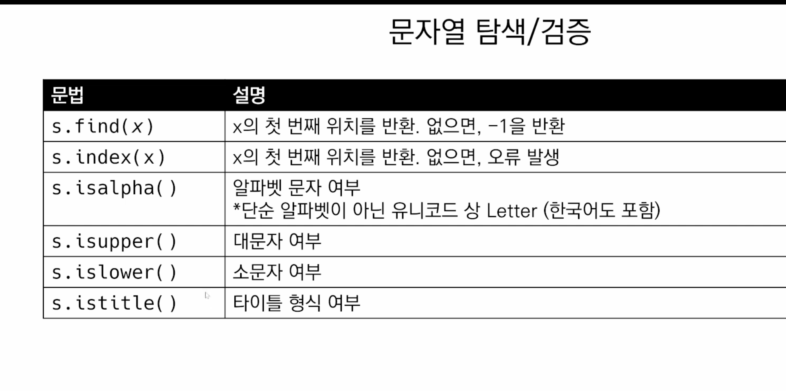
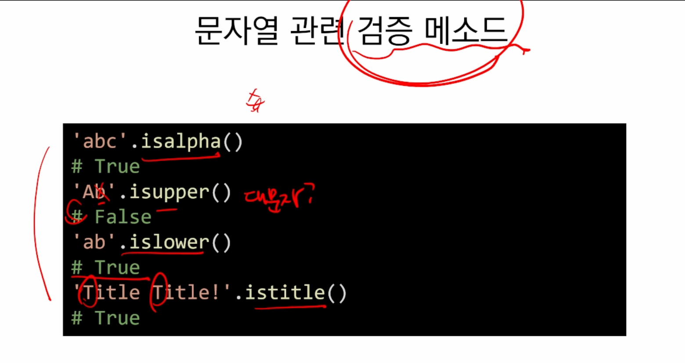
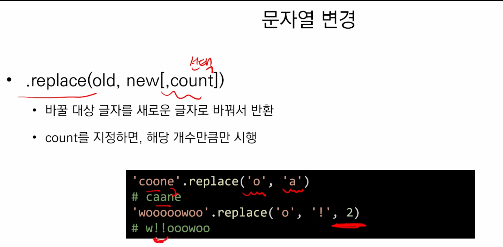
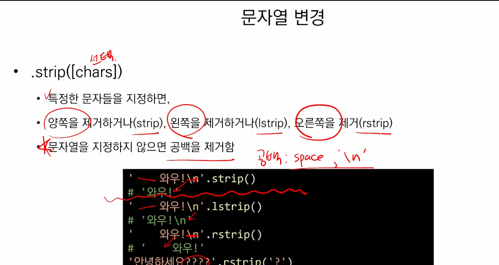
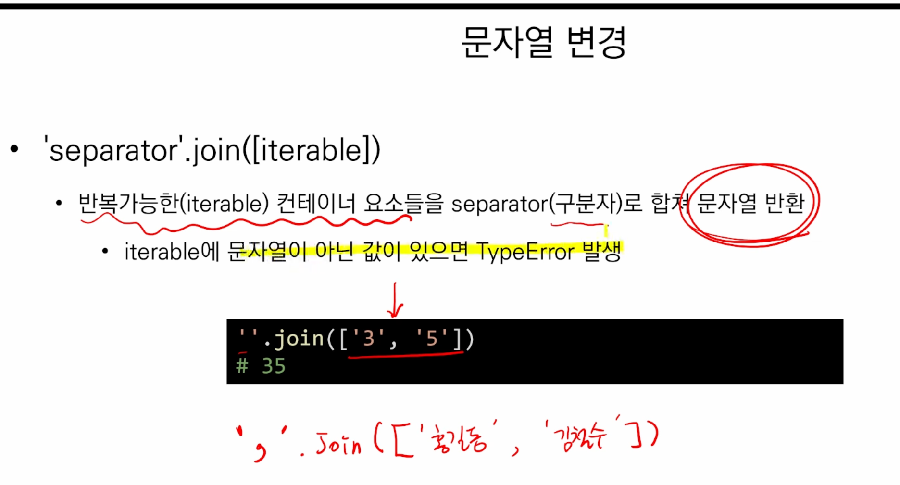
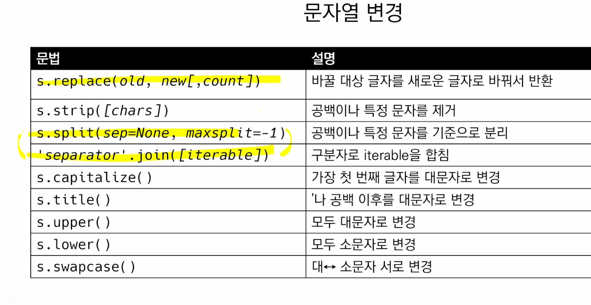
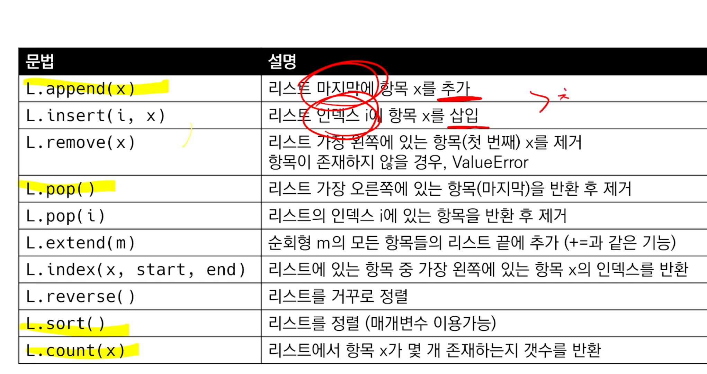
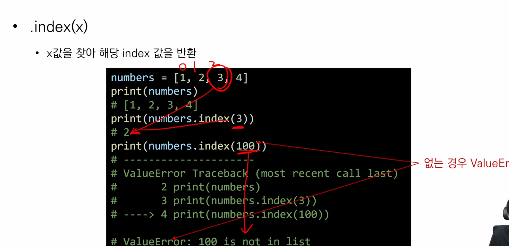

## 1교시 9:00 - 10:00 

---

🔥5주동안의 목표!! 

>  내가 원하는 반복문, 조건문 만들기  
>
> 

### 데이터 구조

### 변수와 타입

* 어떠한 타입을 넣고 어떤 타입을 아웃풋할지 생각해야함 
* Input().split() : 인풋은 문자열이 결과로 나오는 것임, 
  * 문자열.split()
  * [1,2,3].append(4) => 리스트.append(4)
  * `타입.메서드()`  => 주어, 동사 => 타입 너 이거해! 
* 문자열, 딕셔너리 메서드 할 것임


## 2교시 10:00-11:00

---


* 메서드는 원본 자체를 변경, 솔티드 함수 활용 시 원본을 변경하지 않음
* 메서드는 원본 자체가 변경 되어서 할당하는 코드 불필요


### 문자열

* 모든 문자는 str 타입

  

* .find(x)

  * x의 첫번째 위치를 반환, 없으면 -1을 반환
  * 없으면 -1

  


### 문자열 변경





ㄴ공백 제거에 많이 사용


* 조인은 문자열이 아닌 값이 있으면 타입에러가 발생
* 




* Append, insert 문자열 반복 가능한애인데, 
* Remove(x) , pop, clear
* 

✔️extend 는 리스트에 여러 값을 추가하고 싶을떄 리스트 하나로 묶어야함, 문자열 넣을 떄는 한글자 한글자씩 들어가짐

### 탐색 및 정려




* S.v => 메서드
* Sum() => 함수
* 문자열은 immutable 하기로 약속, 리스트는 바꿔줄 수 있음(mutable) => 인덱스에 해당하는 값을 바꿀수 있는지, 없는지


## 3교시 11:00 - 12:00

---

### 딕셔너리

* get : get 사용 시 기본 값을 가지게 할 수 있음(에러 발생하지 않기 위해)
* 추가 및 삭제 : pop 
* Update : 값을 제공하는 키, 밸류로 덮어씀

✔️ 딕셔너리는 키로 접근(인덱스x), 리스트는 인덱스로 접근


### 4교시 13:00-17:00

---

```python
word = 'apple'

for i in range(len(word)): #0~4
    print(word[len(word)-i-1], end='') #5-0, 5-1, 5-2, 5-3, 5-4
    #5, 4, 3, 2, 1에서 -1을 해줌
    #4, 3, 2, 1, 0 => elppa
    #인덱스 번호니까 각 요소에 -1을 해줌
```


```python
#노션실습 17
word = 'banana'
list = []


for char in word :
    list.append(int(ord(char))-32)

print(list)
# print(''.join(map(chr, list)))
[66, 65, 78, 65, 78, 65]
```


* 인덱스로 접근하는 것이 range
* 
