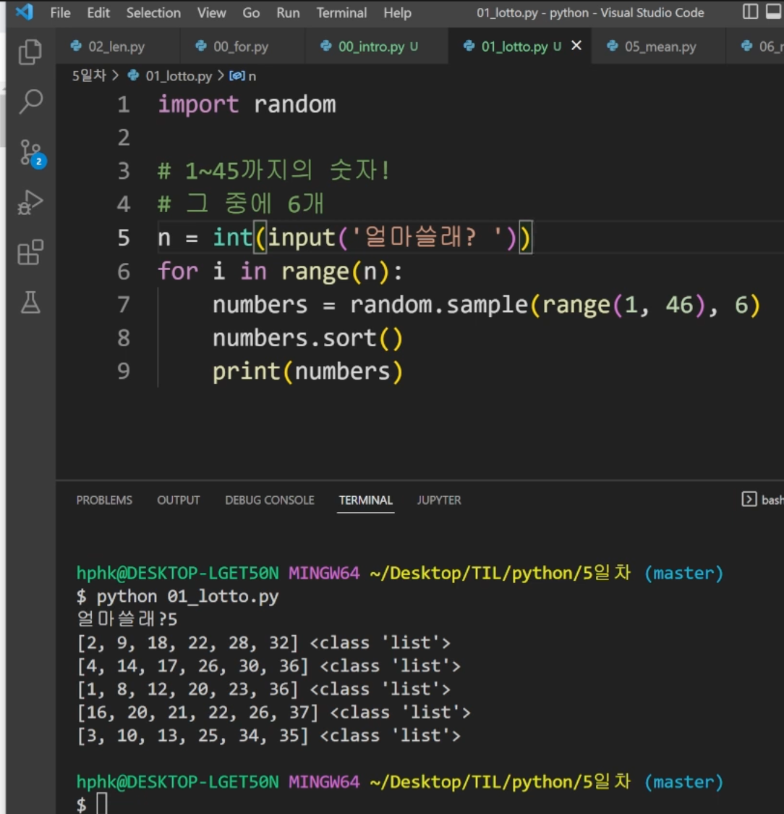
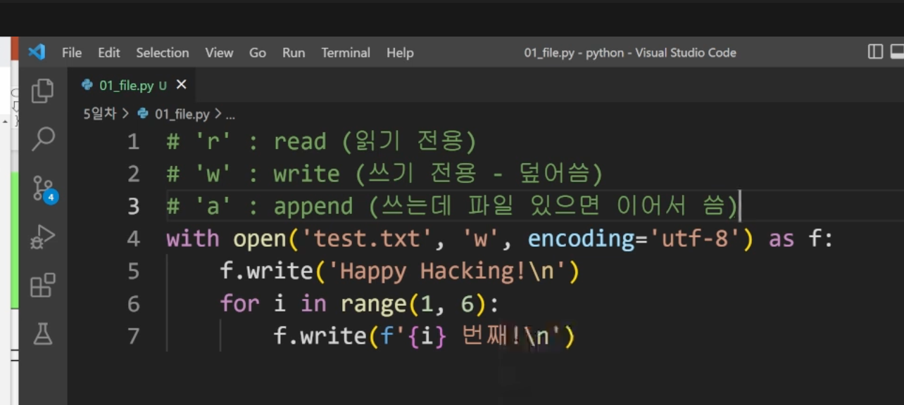

## 1교시 9:00-10:00

---

### 학습방법 조언

* 깃헙 활용해서 풀리퀘
* 불린, 메서드, 딕셔너러리 활용했음 어제 
* 파이썬 자습서 활용 권장!!
* 개념, 구조화
* 모르는 부분 정리해서 질문하기. 
* 개념 강의보다 코드를 더 짜보기
* 실습 도중에는 즉각적인 피드백이 필요해서 디스코드 활용 
* 제일 되야 하는 것 : 내가 지금 조건문으로 char a 랑 같은지를 짜꼬 싶어 !! 
  * 조건문과 반복문을 다양한 형태로 활용 되는 것을 봐야함

### 프로젝트 안내

* 파일을 입출력하는 프로젝트
* 제이슨 데이터 활용

### 모듈

* 모듈: 다양한 기능을 하나의 파일로 -> 오늘!(0715)
* 패키지: 다양한 파일을 하나의 폴더로 -> 여러 모듈의 집합 
* 라이브러리: 다양한 패키지를 하나의 묶음으로 
* Pip : 이것을 관리하는 관리자(파이썬)
* * 파이썬 표준 라이브러리 
    * 파이썬에 기본적으로 설치된 모듈과 내장함수
    * 예시: random.py
    * 코드들 위주로 보기
    * 이벤트까지 남은 날 수 계산

## 2교시 10:00-11:00

---

* 고정폭 글꼴 : 프로그래밍 폰트 기본

### 파이썬 표준 라이브러리

* 파이썬에 기본 내장 되있는 것
* 연산 개체
* import 모듈: 데이트 타입이라는 모듈을 가지고 오는 것
  * from datetime imort datetime123 = import datetime
* 오늘 랜덤 모듈 활용
  * 시퀀스나 집합을 주면 k 길이의 리스트를 반환
  * 

### json 모듈 활용 프로젝트

### 1. 파일 직접 코드로 만들기

* `쓰기`

* `읽기` 
  * Read : 텍스트 전체
  * readline : 한줄씩 읽어서 줌 
  * Readlines: 리스트로 만들어줌 

## 3교시 11:00 - 12:00

---

* json loads
* jason dump
* Jason : 문자열로 구성 된 형식

포크는 내껄 가져와서 커밋하는 행위 

포크 누르고,

1. 오너가 나의 이름이어야 함을 확인하고 생성
2. 내꺼 저장소에 잇음 
3. 내꺼를 복제, 클론
4. 바탕화면에 깃 클론 +주소 (마스터가 없는 상태임을 확인해야함)
5. 회차에 폴더 복사(n회차 홍길동)열어서 리드미 파일 보고 
6. 복사한 폴더를 vscode로 열기 
7. Git add, git commit -m 커밋 만들기
8. 깃 푸쉬 오리진 마스터함
9. 깃헙 가서 풀리퀘를 만들기
10. 풀리퀘는 내 저장소에서 컨트리뷰트> 또는 풀리퀘 > 새 풀 리퀘 > 내꺼에서 원본으로 보내는 모습보고 버튼 누르기 
11. 04에서 프린트(무비), 딕셔너리 타입이 나옴
12. none이 뜨는 이유는 코드 완성 후 리턴
13. 원격 보냈으니, 원본으로 보내기 위해 풀 리퀘 > 뉴 풀리퀘 > 
14. 조건문, 반복문, 적절한 프린트, 
15. 무슨 코드를 작성하고 싶은지? 접근 방법은? 
16. 

