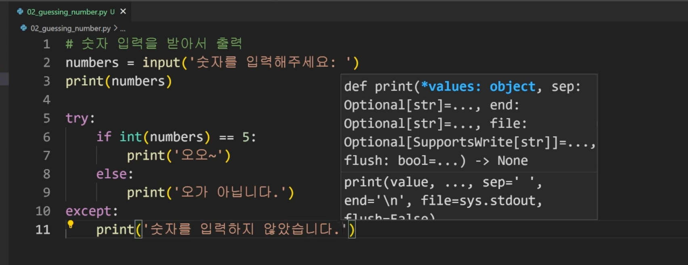
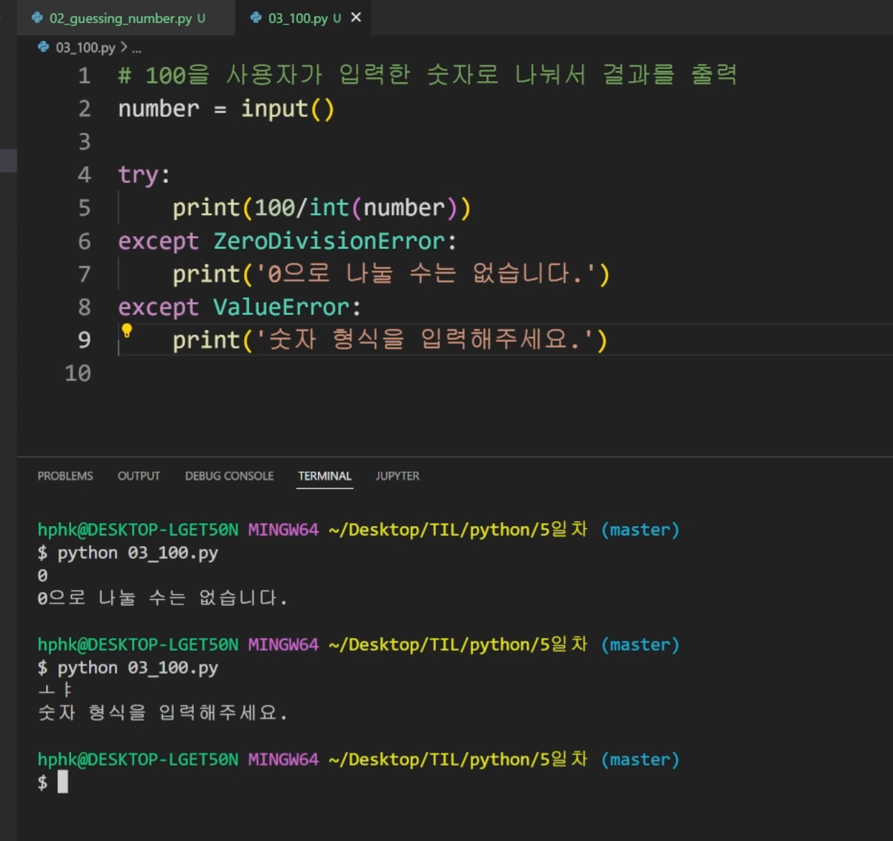
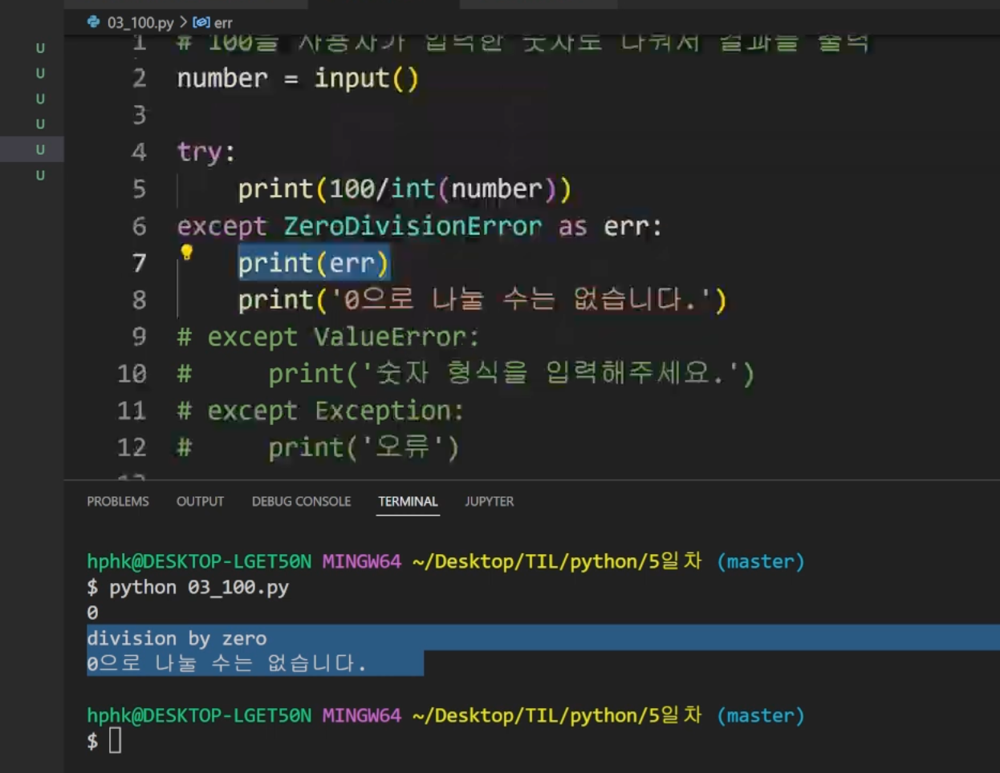

## 1교시 9:00 - 10:00

---

* 알고리즘 문풀, 코드 구현에 있어서는 쎈수학임(유형별 문제가 1000개 이상)

> 문제를 계속 푸는 것 
>
> 문제풀이 접근방법을 계속 익히는 것
>
> 개념이 중요하지만 코드가 안 풀렸을 때 지금 수준에 있어서는 문제를 많이 푸는 것이 중요하다. 

### 딕셔너리 추가 설명 -> 다시보기

- 값들 나열의 중복 제거 : set 사용

## 2교시 10:00 - 11:00

---

* 프린트 함수를 활용
  * 특정 함수 결과, 반복/조건 결과 등 나눠서 생각
* Vscode 활용
* 파이썬 튜터 활용
* while경우, 종료조건이 제대로 동작하는지?

### 문법에러

* 쉽게 고칠 수 있음
* 파일이름, 줄번호, ^문자를 통해 파이썬이 코드를 읽어나갈 때 문제가 발생한 위치 확인
* 리터럴 오류: 숫자, 문자 같은 걸 같이 사용하는..? 값을 넣을 수 없다! 식별자 잘 만들어라

### 예외

* Zerodivisionerror : 0으로 나눌 수 없다 
* Namerror : 선언되지 않은 변수일 때, 이름 공간 상에 이름이 없는 경우, 변수에 오타있는지도 확인
* 타입에러: 타입 불일치, 문자+숫자를 더하던가, 숫자열 넣어야 하는 곳에 문자열이 들어간다던가
* 벨류에러: 
* 인덱스에러
* 키에러
* modulenotfounderror : 
* importerror : 
* Indeneteationerror:
* keyboaradinterrupt: 키보드에 의해서 종료 control+c

### 3교시 11:00 - 12:00

---

### 예외처리

* try문

* except 문

  

* 여러개 각 except 지정 가능

  

### 에러 발생시키기

* Raise : 에러라는 것을 알려주기 위해서

* 파이썬에 있는 에러도 같이활용하고 싶을떄

  

✔️예제 11번 다시 보기 복습

