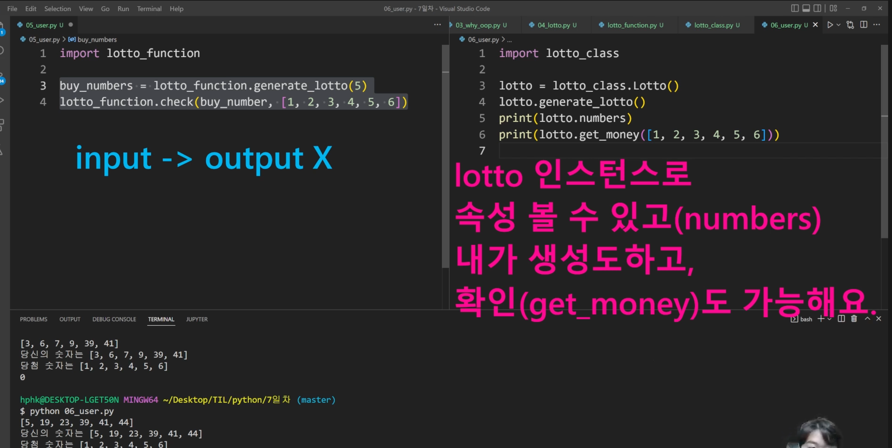
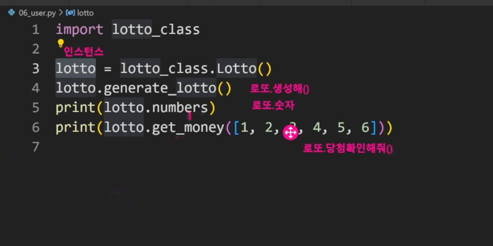
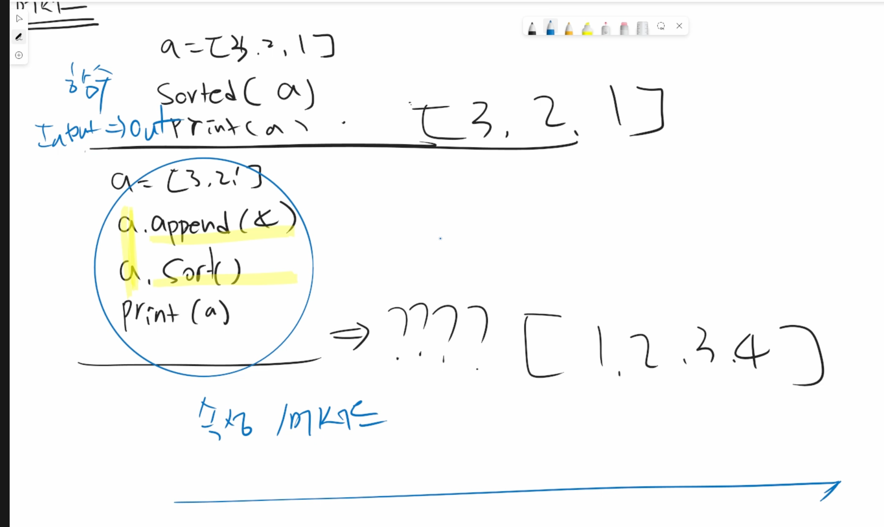

## 1교시 9:00-10:00

---

✔️파이썬 조건과 반목문 어떤 타입들 자유자재로 다루기  

✔️다양한 문제를 보기 

### 객체지향 프로그램

## 2교시 10:00-11:00

---

## 3교시 11:00-12:00

---

### 클래스의 속성

* 한 클래스의 모든 인스턴스라도 똑같은 값을 가지고 있는 속성
* 클래스 선언 내부에서 정의 
* 빌트인(내장)
* 글로벌(함수 외부)
* 로컬(함수 내부)
* 클래스 메서드 
  * 클래스가 사용할 메소드
  * @classmethod 데코레이터를 사용하여 정의 
  * 함수를 어 떤 함수로 꾸며서 새로운 기능을 부여
  * 호출 시, 첫번째 인자로 클래스가 전달 됨
* 인스턴트 메서드: 인스턴스 자체에 필요한 경우
* 클래스 메서드: 클래스가 호출을 할건데, 메서드 내부에 클래스 자체가 필요할 경우 
* 스태틱 메서드: 내부적으로 클래스 인스턴스 모두 필요 없을 때 
  * 스태틱 메서드 안에서는 클래스, 인스턴스 쓸 수 없음
* 메서드 괄호 안에 들어간 것은 이름 붙이기(예약어 아님)

### 객체 지향의 핵심개념

* 객체지향의 핵심 4가지
  * 추상화
    * 어떤 기능/정보(로또)만들어 놓고 동작할 수 있는 메서드를 정의 
  * 상속
    * 두 클래스 사이 부모-자식 관계를 정립하는 것
    * 클래스는 상속 가능함
    * 상속 관련 함수와 메서드
      * super() : 자식클래스에서 부모클래스를 사용하고 싶은 경우 
      * 중복 된 코드를 재사용하지 않도록
      * 부모클래스의 모든 요소가 상속 됨(속성, 메소드)
    * 다중상속
      * 두 개 이상 클래스를 상속 받는 경우
      * 장고에서 확인 가능
  * 다형성
    * 여러 모양
    * 메소드 오버라이딩
  * 캡슐화
    * 실제로 파이썬은 수단과 방법을 써서 접근가능, 보안
    * 헷갈려서 수업에서 디테일하게 다루진 않음
    * Public : 어디서나 접근 가능
    * Protected : 부모/자식에서만 가능
    * priviate : 본인만 접근 가능 -> 클래스 그 자체에서만 쓸 수 있음

### 오전 수업 정리

* 클래스 / 인스턴스 감 잡는게 중요
* 어떠한 기능, 모습을 설계할 떄 person이라 하는 것은 사람이고 그 안에 아이유, 지민이 있음
  * 공통적으로 활용하는 메서드가 있고, tak.greeting(), tak.name, tak.age > 이름과 나이가 속성으로 정의가 되어있어야
  * 동물이 있고, 그 중에 사람이 있을 수 있고 강아지, 고양이가 있을 수 있음, 각 이름이 있는 상태로 상속 받아서 활용할 수 있음
  * 사람만 할 수 있는 것이 있을 때, 추가적으로 메서드 정의 
  * 공통적으로 밥먹을 수 있음
* 객체
  * 메서드
    * 클래스 메서드, 인스턴스 메서드
  * 속성
    * 클래스 변수, 인스턴스 변수

✔️지금 단계에서는 펄슨이 클래스고, 수많은 지은, 지민 처럼 인스턴스들이 있을 수 있고 각 인스턴스가 쓰는 것이 인스턴스 메서드가 있음 

✔️클래스가 사용하는 것은 클래스 메서드

✔️객체에는 메서드가 속성이 있다! 

