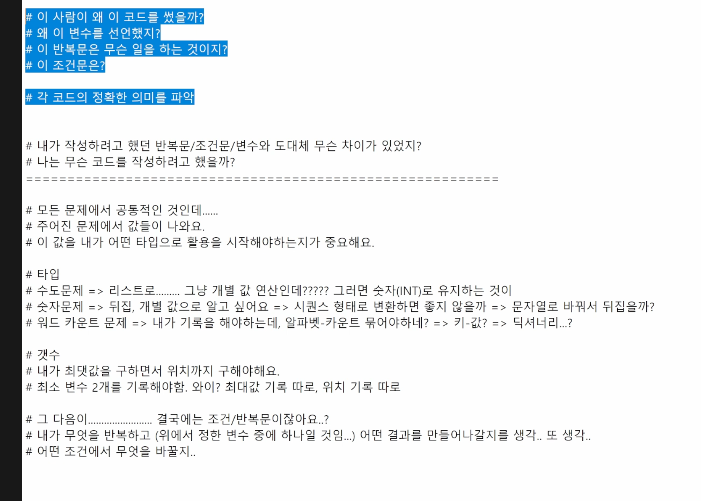
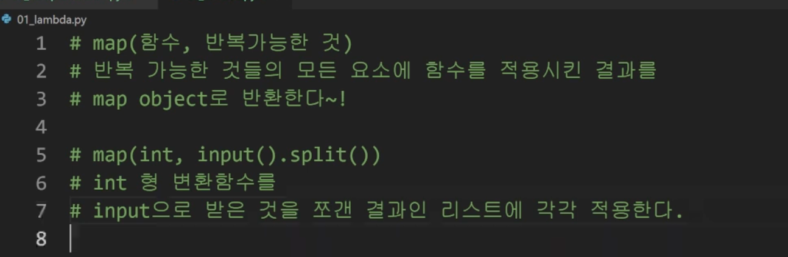

## 1교시 9:00 - 10:00

---

🔥오늘도 화이팅🙏

### 패키지

* 개발한다는 건 이런거구나.

## 2교시 10:00 - 11:00

---

### 파이썬 응용/심화 파트

* List comprehension

* dictionarty comprehension

  * 생성하는 코드 대체 

* 람다함수

  * 직접 정의학에는 한번만 쓰고 말것이기 떄문에 정의하지 않고 사용하는 기능

  * 이름 없는 함수, 익명함수
  * return문 불가ㅗ들에 모든 함수를 적용 시킴
  * 간편 조건 문 외에 조건문/반복문 사용 불가 
  * Map(__,__) : 반복 가능한 요소들에 모든 함수를 적용 
    * Map(함수, 반복 가능한 것)
    * 

​			

### 파이썬 버전별 업데이트

* 하위 버전 사용하는 경우, 상위 버전 사용하는 경우 생기는 문법들을 관심가지고 읽고 보고 이해해야함
* 위치 저용 매개 변수
* 변수 어노테이션 
* 함수 어노테이션
  * 그냥 힌트, 주석, 노트, 메모
* 소프트웨어 업데이트에 따라 앱을 사용 불가할 수 있는 것처럼 개발 언어 vs패키지와 관계도 그렇게 됨

### 파이썬 개발 환경

### 모듈 심화

* 다양한 기능을 하나의 파일로 
* 패키지를 하나의 폴더로 => 패키지
* 패키지를 하나의 묶음으로 => 라이브러리(텐서플로)
  * 머신러닝하기 위해 다양한 하나의 코드로 묶어서 대신 제공
* 파이썬 표준 라이브러리
* 파이썬 패키지 관리자
* 같은 도구를 써야할 때, 설치 소프트웨어를 공유함 
* 사용자는 url로 요청보내면 개발자는 응답을 받음
  * url 요청 보내고 -> requests
  * 응답을 html 받아서 
  * 조작
  * 크롬 브라우저에서 했던 것을 파이썬 코드 요청을 보내주는 requests! 
  * 실시간 데이터를 활용하기 위해서 json형식이 너무나 좋음

