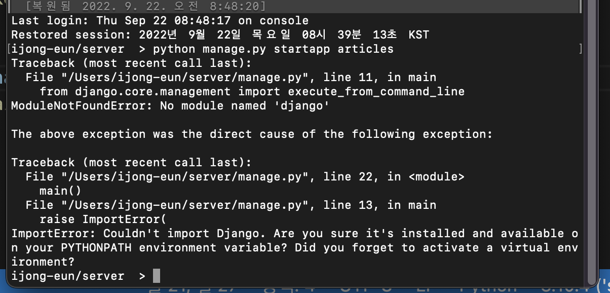

## 9:00-10:00

---

* 3점대 버전 선택한 이유
  * 장기지원 버전(LTS)
  * 일반적인 경우보다 장기간에 걸쳐 지원하도록 고안된 소프트웨어 버전

### 파일 정의

* **셋팅, urls 파일 많이 사용할 것임, 중요!** 
* 인잇파일은 무시
* Asgi 파일은 비동기식 웹 서버와 연결 및 소통하는 것을 도움
* 배포 시에 사용하며 지금은 수정하지 않음
* Urls 파일은 주문서 파일
* Wsgi 
* Manage 장고 프로젝트와 다양한 방법으로 상호작용하는 커멘드라인
* 어플리케이션 모음인 프로젝트

### 구성

* 스타트 하면 프로젝트가 생김
* 폴더 단위로 관리하게되는 파일묶음
* 밑에 추가할 것이 어플리케이션(기능) 추가 됨
* 기능들의 묶음
* 기능마다 여러 어플리케이션 

### 시작(앱생성)

* python manage.py. startapp articles
  * 앱 생성
* 에러뜸 
  

* 가상환경 키고 다시 명렁어 시도
* 아티클 내 어드민은 관리 기능 넣을 것임
* 앱 파일은 컨피그 
* ⭐️뷰즈라는 파일이 가장 중요!⭐️
* 현재는 앱을 생성만 한 것임
* 등록의 단계는 장고라는 프로젝트에게 등록해줘! 라는 것은 pjt 폴더의 셋팅 파일에 인스톨드 앱스(장고앱이 가지고 있는 앱 목록들)내 앱들을 알아서 등록해줌
  * 앱 만들고 셋팅즈>인스톨 맨앞에 넣기 
  * 지울때는 거의 반대로 인스톨에서 지우고, 아티클 폴더 지우고 

### 프로젝트 

* 앱의 집합
* 앱은 하나의 역할 단위 및 기능 단위로 작성

### 요청과 응답

* 앱은 실제 요청을 처리하고 페이지를 보여주는 등의 역할을 담당

* 웹서비스는 웹이란 매개를 통해 전달하는 서비스

* **요청은 유알엘이라는 것을 통해서 이루어지고, 응답은 문서를 통해 이루어짐(html)**

* 앞이 누구에게 뒤에 무엇을~

* **응답**

  * **주문서 정의 => 유알엘.py**
  * **처리로직 구현 =>  views.py**
  * **hmtl 페이지 구성 => templet.index.html**

  

* 웰컴페이지
* 계산기
* 점심 메뉴 추천

장고로 앱을 만들면 어드민 화면을 자동으로 만들어짐

주문서에 이름 넣으면 거기에 맞는 이름이 나올 수 있도록! 

* 로또 기능! 

## 실습 

---

1. 가상환경 생성 실행
   python -m venv [가상환경 이름]
2. 실행
   * .venv/bin/activate
3. 장고 설치
   * pip install Django == 3.2.13
4. 장고 프로젝트 생성
   * Django-admin startproject django_0922
   * Pip list로 설치여부 확인 가능
5. 앱 생성, 시작
   1. 커멘트를 manage.py가 있는 경로에서 실행행해야함(가상환경 액티브 .venv/bin/activate)
   2. Manage.py 프로젝트 관리 폴더
   3. python manage.py startapp training[앱이름]
6. 앱 등록
   * vscode켜야함
   * 셋팅에 앱 넣음
7. 서버실행이 되는지 테스트
   1. 가상환경 실행
   2. ls에서 가상환경 폴더 확인 > ls manage.py확인
   3. python manage.py runserver
8.  앱 url >뷰>템플릿
   1. url파일에서 트레이닝앱의 뷰 파일 불러오기 
   2. form traning import views
   3. 패쓰 만들기 url,실행할 뷰 함수 작성, 유알엘, 실행할 뷰 함수
      1. path('index/', views.index) >인덱스 함수
9. 뷰 파일에 가서 인덱스 함수 선언 정의
   1. Def index(request): # 응답할 것
   2. retrun render(request, 'index.html')
10. 템플릿 폴더를 트레이닝폴더 안에 만듬
11. 템플릿 폴더안에 인덱스.html 파일 만듦

### 

### 템플릿 변수

* 

### 새로운 앱 생성

1. 주문서 생성

   * Urls.py 파일에서 패쓰 추가 

   * 뷰즈에 메뉴라는 함수로 핸들링 할 것이라는 문구도 추가 

2. 뷰즈 파일에 접속해서 함수생성
   * 함수 생성 후, 리턴 렌더함수 안에 html파일명 씀
3. 템플릿 파일 내 새로운, 리턴함수에 안에 쓴 html파일 생성
4. html에 작성

