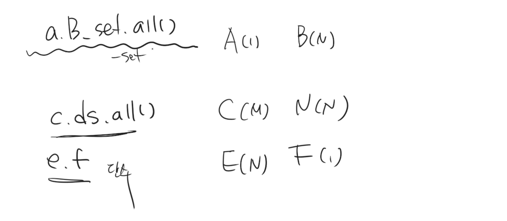

## 어제 수업 정리

---

* 사용자가 있고 요청, 응답
* 

### 유저와 유저와의 관계 - 팔로우

* 어카운츠 모델에서 유저 클래스에 새로운 필드를 추가
* self를 넣게 됨
  * 연관있는 모델 클래스를 입력 
* 팔로잉
  * a가 다른 b를 팔로잉함(친구신청)
  * b입장에서는 팔로워로 a가 등록됨
  * 맞팔: 서로가 서로를 팔로잉 => symmertrical=false, 12, 21존재
  * 일촌맺으면 서로 일촌이 되는 것은 => symmertical=true, 12만 존재 거꾸로는 존재안됨
  * 팔로워: 내가 친구 맺음 당한것/ 팔로잉: 내가 친구신청한 것
* 팔로잉 기능 구현
  * 사용자 프로필 페이지에 들어가서
  * 팔로우 상태가 아니면, 팔로우를 누르면 추가,(add)
  *  이미 팔로우 상태이면, 팔로우 취소 버튼을 누르면 삭제(remove)
* 좋아요 기능
  * 좋아요 누르지 않았으면 좋아요 누르면 추가
  * 좋아요 누른 상태이면, 좋아요 취소 버튼을 누르면 삭제
* 팔로우/팔로우 취소 요청을 할 떄 url은? 
  * /accounts/<int:pk>/follow/
  * 처리 완료 후에는 사용자 프로필 페이지로 리다이렉트
  * 단, 셀프 좋아요는 허용이지만 셀프 팔로우는 허용할수 없다. (If)
* 매니투매니필드
  * 셀프인 상황속에서 고려해야 하는 것 => 대칭여부를 보고 기능구현으로 완료 
  * 뷰스보면 라이크와 팔로우는 똑같은 코드구조임
  * 코드는 암기보다는 원하는 로직들을 설계하는 것

## 추가 장고 내용

---

### 뷰 데코레이터

* 뷰함수는 무조건 httprespose객체를 리턴함
  * 템플릿이 리턴 되는 것보다, 템플릿 역시도 무언가의 처리가 일어나는 하나의 작은 액션
* veiws.py
  * render
    * Status code 2xx html 리턴
  * redirect
    * Statuscode 3xx
    * @login_required 
  * 400의 상황이란? 
    * 패아자 넛 퍼윤두(400번대)
    * 주소창 잘못 입력 했을 때
  * 500의 에러를 띄울려면? 
    * 뷰에서 코드 잘못쳤을 때
    * 모든 에러 페이지(유알엘 없다 제외 )는 500에러임
    * 인터널 서버 에러
  * doesnotexist 오류(500에러)
    * get을 땡겨왔는데, 여러개가 아니고 한개 인데, 없을때!! 오류 노출
    * 게시글 없는 곳으로 디테일 들어온 것은 클라이언트 잘못인데, 주소창으로 굳이 들어와서! 
    * 숏컷에 get_object_or_404() 임포트해서 사용
      * article = get_object_or_404(Article, pk=pk)
      * 이렇게 하면 404에러가 뜸 => 유저잘못
      * 500에러에서 404에러로 변경
  * 데코레이터
    * 삭제버튼을 포스트 요청으로 보냈었는데, 
    * 데코레이터http import require_post
    * @require_post
    * 겟 요청하는 것에 데코레이터를 달아놓으면 페이지가 작동하지 않는다는 오류 뜸
    * @require_safe

### 펑션

