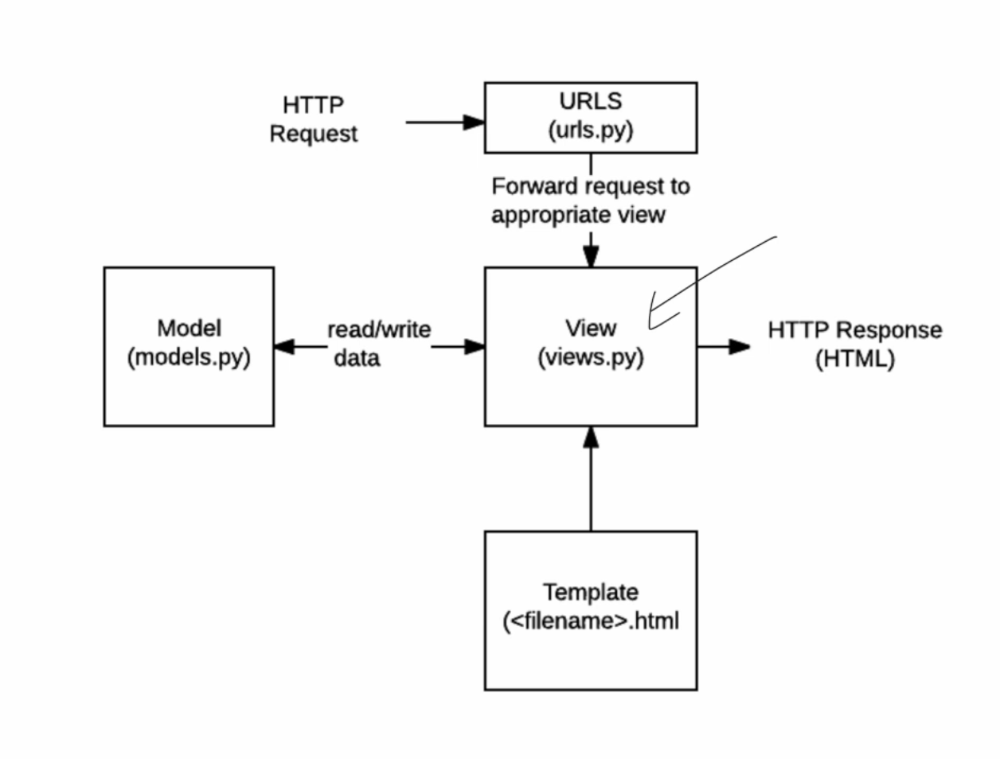

## 프로젝트 리뷰 특강

### 개발자란? 

* 문제를 

## 1. AJAX

* 서버와 비동기적으로 통신하는 방법
* get요청을 서버에 보냄
  * 유알엘 지겁 입력 
  * 버튼 클릭 
  * ajax비동기
    * 부드러운 화면 전환
* 서버에서 파일 을 보내줌
* ajax요청 방법
  * 옛날방식
  * fetch/.then_ 최신방식
  * axios 등 외부 라이브러리 방식
* Xml vs json
  * Json 

## 2. axios

* 사용자가 어떤 특정한 행동을 할 때 

## 3. API

* api정의
  * 응용 프로그래밍 인터페이스
  * 통신할 떄 어떤 방법과 `규칙을 애기하는 것 `
* 주변에서 예시 찾기
  * 
* api 어떻게 활용?
  * 클라이언트 측 : 브라우저 url 입력창
  * 서버측 : api가 규칙인데 로그인, 로그아웃등의 기능들 => 사용자가 어떤 버튼을 누르면 어떤 메서드로, 어디로 보내줄지
* 카카오 소셜 로그인
  * 은행창구
  * 클라이언트 아이디는 나의 신분증
* api의 종류
* 유용한 오픈 api
* api를 이용한 프로젝트

## 4. rest API와 기능

