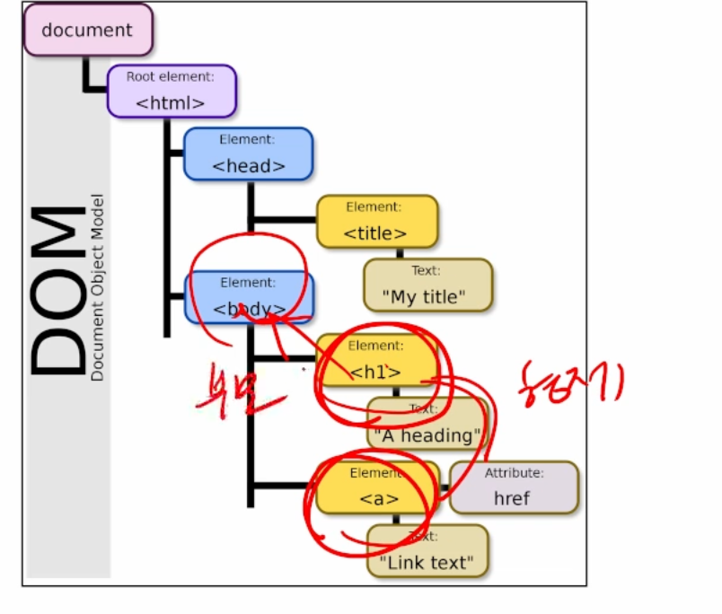
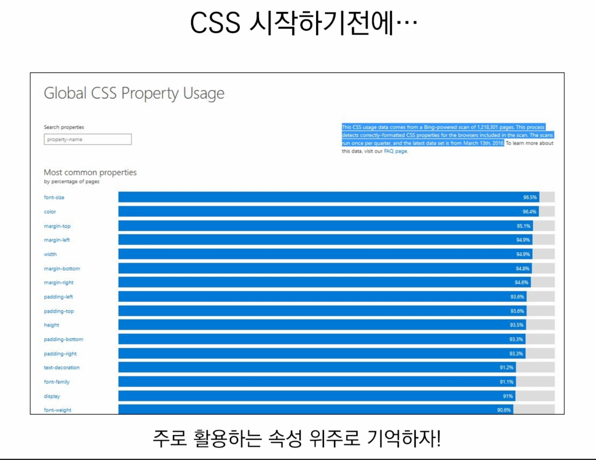

## 10:00 - 11:00

---

### 학습방법

* **html / css, js기초** 이렇게 3가지 배울 것임 => 그 뒤 장고, 프로젝트도 웹 과정임
* 웹 화면을 설계할 수 있음
* 기초 파이썬 자리가 안잡혀있으면, 살짝 어려울 수도 있음 그치만 내용 자체가 어려운 것은 아님
* 많이 만들어보고, 많이 연습해보는 것이 가장 중요함
* 직접 손이 많이 움직여야함 => 실습 비중늘려서 진행할 예정 => (개인)수요일 오후 실습~목요일까지 개인 프로젝트 진행 => 목요일 오후 늦게: 서로 리뷰
  * (팀, 2인)금요 프로젝트는 페어 프로그래밍: 드라이브/네비게이터.  
* 기초적인 웹 사이트를 구성할 수 있고, 장고(서버)를 구축할 수 있음

### happy web

* 대부분의 서비스는 웹을 기반으로 하고 있음
* 데이터 분석 경우도, 분석 후 다른 사람들에게 표현하기 위해서 웹 도구를 사용해야함
* 프로젝트를 사용한 모든 것을 표현하기 위해도 중요함
* 웹 사이트의 구성 요소
* html: 구조
* css: 표현
* Javascript : 동작
* 마우스 오른쪽 > 페이지 소스보기> html을 통해서 구조를 보여주고 있음 

### html/css

* 움직임을 표현하는 것은 어렵고 화면을 그리는 것 임
* 웹사이트와 브라우저
  * 웹사이트는 브라우저를 통해 동작함
  * 브라우저마다 동작이 약간식 달라서 문제가 생기는 경우가 많음(파편화)
  * 해결책으로 웹 표준이 등장
  * Caniuse 사이트에 브라우저별 점수가 있음

### 웹 표준

* 웹에서 표준적으로 사용되는 기술이나 규칙
* 어떤 브라우저든 웹 페이지가 동일하게 보이도록 함(크로스 부라우징)
* 

### html 기초

* 하이퍼 텍스트 마크업 랭키지
* 하이퍼 텍스트란? 하이퍼링크를 통해 사용자가 한 문서에서 다른 문서로 즉시 접근할 수 있는 텍스트
* 마크업 렝기지란? 구조를 나타내는 언어
* ㅇ웹 페이지를 작성 구조화하기 위한 언어
* .html 파일에서 작성

### html 기본 구조

* 태그 부터 시작함 헤드가 있고 바디가 있음
* 헤드: 문서의 메타데이터 요소
  * 정보의 정보, 데이터의 데이터 => 사진데이터도 010101로 이루어져 있음, 사진데이터를 위한 데이터는 셔터스피드, 노출, 장소, 시간 등
  * 문서 제목, 인코딩, 스타일, 외부파일 로딩
  * 일반적으로 브라우저에 나타나지 않는 내용
  * Title : 브라우저 상단 타이틀
  * meta: 문서 레벨 메타데이터 요소
  * Link: 외부 리소스 연결
  * 
* 바디: 문서 본문 요소

## 11:00 - 12:00

---

* 요소
  * 각 요소를 여는 태그, 닫는 태그
  * 내용이 없는 태그들도 존재(닫는 태그는 없음)
  * Br: 
* 속성
* 렌더링
  * 웹 사이트 코드를 사용자가 보게 되는 웹 사이트로 바꾸는 과정
  * 어떤 화면을 만드는 것
* Dom 트리
  * 텍스트 파일인 html 문서를 브라우저에 렌더링하기 위한 구조
  * html문서에 대한 모델을 구성함
  * 

### css란?

* 캐스캐이딩 : 위에서 아래로 흐른다. => 위에서 아래로 흐르면서 스타일을 입혀준다. 
* 문서에 스타일을 지정하기 위한 언어 
* 선택하고, 스타일을 지정한다. 
* 정의방법 1: 관리가 안됨, 해당 태그에 직접 스타일 속성을 활용
* 정의방법 2: 헤드 태그 내에 스타일 지정해서 사용 => 수업을 위해 해당 방법으로 사용할 것임
* 정의방법3: 외부 css 파일을 헤드 내 링크를 통해 불러오기 => 경로로써, 파일의 위치를 넣어서 사용
* Css 정의방법(외부 참조)
  * 오늘 실습: 문서읽기
    

* 선택해서 스타일, 무슨기준? => 아이디 > 클래스 >  태그 
  *  헤드에 선언순서에 따라 다름 > 클래스 클래스 처럼 동일한 것이 있을 때 나중 것이 적용
  * 같은 레벨이라면 나중에 선언 된 것이 적용
  * 아이디, 클래스, 태그는 서로 다른 레벨임
  * 아이디 > 클래스 > 태그 순으로 우선순위를 가짐
  * **다만, 일반적으로 css 스타일링은 클래스로만 함** 
  * 아이디는 잘 활용하지 않고, 자바스크립트로 개발할 때 활용
  * 아이디는 문서에서 반드시 한번만 등장해야함! # 으로 시작함
  * 

### 정리

* Html: 문서의 구조, 태그 , 속성

* Css: 스타일링, 무엇인가를 선택해서 스타일 => 태그, 클래스, 아이디

  

