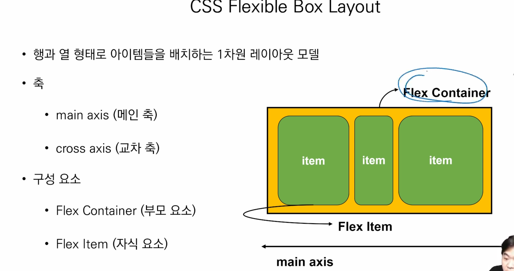

H1, p, div, image를 많이씀

## 10:00-11:00

---

* 네모 세상에서 인라인과 블록으로 배치가 되어있었음
* 이 흐름을 벗어나서 네모가 겹쳐있을 때, 이미지 안에 플레이 버튼 있을 때? 

### css position

* 문서 상에서 요소의 위치를 지정, 지금까지는 자동으로 배치되었음
* 스태택: 모든 태그의 기본 값(기준위치)
  * 일반적인 요소의 배치 순서에 따름(좌측 상단, 네모)
  * 부모 요소 내에서 배치 될 때는 부모요소의 위치를 기준으로 배치됨

1. 릴래이티브: 상대위치
   * 자신의 스태틱 위치를 기준으로 이동, 노말 플로우유지
2. 앱솔루트: 절대위치
   * 요소를 일반적으롬 ㅜㄴ서흐름에 제거된 후 노말 플로우에서 벗어남
   * 스태택이 아닌 가장 가까이 있는 부모/조상 요소의 기준으로 이동
   * 영역 위에 존재할 때 씀, 부모를 릴래티브 주고 앱솔루트
3. 픽스드: 뷰포트 기준으로 이동, 노말 플로우에서 벗어남=>밑에 고정 된 것(스크롤 내려도 고정)
4. 스티키: 스크롤에 따라, 스태틱 -> 픽스로 변경 =>위에  화면에 따라 고정 되는 애들
5. 위에 있는걸 밑으로 끄집어 내릴 때, 수직정렬이 어려움, 수평일때는 마진주면 됨

## 11:00-12:00

---

* 노멀플로우, 좌측 상단에 배치, 디스플레이에 따라 크기와 배치가 달라짐
* 포지션으 위치로 기준을 변경
  * 릴레티브 본인의 원래위치, 나중에 돌아오기 때문에 비어있음
  * 앱솔루트 특정 부모의 위치, 텍스트 넣었을 때 부모요소가 스태틱이 아닌 요소로 감, 스태틱 아닌게 없으면 바디로감
    * 무언가 영역 위에 존재하고 있을 때, 부모를 렐러티브 주고 앱솔루트
  * 픽스 화면의 위치 
  * 스티키

### css 레이아웃

* 디스플레이
* 포지션
* 플로트: 그 전까지는 다 플로트였음
  * 기본 원칙을 깨는 방법 중 하나
  * 박스를 왼쪽 혹은 오른쪽으로 이동시켜 텍스트를 포함 인라인 요소들이 주변을 wrapping하도록 함
  * 요소가 노말 플로우를 벗어나도록 함
  * 신문

* **플렉스박스: 혁신적이었음 2012**

  

* 부모에 플렉스 컨테이너 지정하면 자연스럽게 자식 요소들은 아이템이 됨

* 메인축과 크로스축이 생김

* 부모의 플레스 지정, 자식은 플렉스 아이템으로 표현

* 플렉스 컨테이너 안에서 메인축과, 크로스 축이 생김

* 행, 열을 바꿀 수 있음

* 부모요소, 자식요소가 있음

  * 부모요소에 디스플레이 플렉스를 하게되면 자식요소는 아이템으로 활용하게 됨
  * 디스플레이 속성을 플렉스 혹은 인라인 플렉스로 부모요소에 줘야함!!!!

* 왜 사용해야할까? 

  * 수동 값 부여 없이 수직정렬이 어렵고, 아이템의 너비와 높이 간격을 동일하게 배치하는 것이 어려움

* 그리드

* 기타

### 플레스 속성

* 배치설정
  * 플렉스 디렉션
  * 매인축 기준으로 방향 설정 => 로우면 로우, 컬럼이면 컬럼
  * 역방향(리벌스)의 경우 html태그 선언 순서와 시각적으로 다르니 유의
  * 한국에서는 리벌스 쓰는 경우 거의 없음
    * 로우
    * 로우 리벌스 => 이게 기본인 나라가 있음
    * 컬럼
    * 컬럼 리벌스
  * 플렉스 랩
    * 아이템이 컨테이너를 벗어나는 경우 해당 영역 내에 배치되도록 설정
    * 기본적으로 컨테이너 영역을 벗어나지 않도록 함
    * 랩: 사이즈 유지해서 밑으로
    * 노랩: 사이즈 변화됨
  * 플렉스 디렉션, 플렉스 랩 같이해서 플렉스 플로우라는 걸 쓸 수 있음 => 축약 된 것이지만 나중에 알아도 됨
* 공간 나누기
  * 저스티 컨텐츠
    * 메인축 기준으로 공간 배분
    * 메인축 기준으로 알아서 해주는 것 (행)

* 정렬

  * 얼라인 아이템
    * 클로스 축 기준으로 정렬(열)세로
    * 베이스라인이 가장 새롭게 보일텐데, 알파벳 쓰는 종이 생각하면 됨

  * 얼라인 셀프 : 개별 아이템 적용
    * 개별 아이템을 크로스축 기준으로 정렬

* 수평, 수직 정렬하고 싶을떄, 저스티컨텐츠, 얼라인 아이템 두개를 사용하면 됨

* 플렉스에 적용하는 속성

  * 플렉스 그로우
    * 남은 영역에 그 크기를 분배해주는 것, 같은 비율로 증가함
  * 플렉스 오더

* 활용 레이아웃 - 카드배치

 ### 정리

* css 원칙
* 모든 요소는 네모, 왼쪽 위로 붙음
* 깰 수 있는 방법으로 포지션
  * 렐러티브는 본인의 원래 위치, 조금 이동하고 원래 위치에는 아무도 못옴
  * 엡솔루트는 특정 부모가 스태틱 아닌 부모 기준으로 했을 때, 움직이는데 원래 위치가 사라져서 밑에 있는 요소들이 올라옴
  * 픽스드와 스티키는 화면을 기준으로 움직임, 스티키는 기분적으로 스태틱이나 스크롤 이동에 따라 픽스드로 변경
* 레이아웃
  * 플렉스 박스
  * 부모가 컨테이너고 자식들은 아이템이다 
  * 메인축과 크로스축이 있고, 공간 배분을 어떻게 할지, 크로스축에서 정렬을 어떻게 할지

### 실습

---

어제자 만든 것을 플렉스로 바꾸어 제출