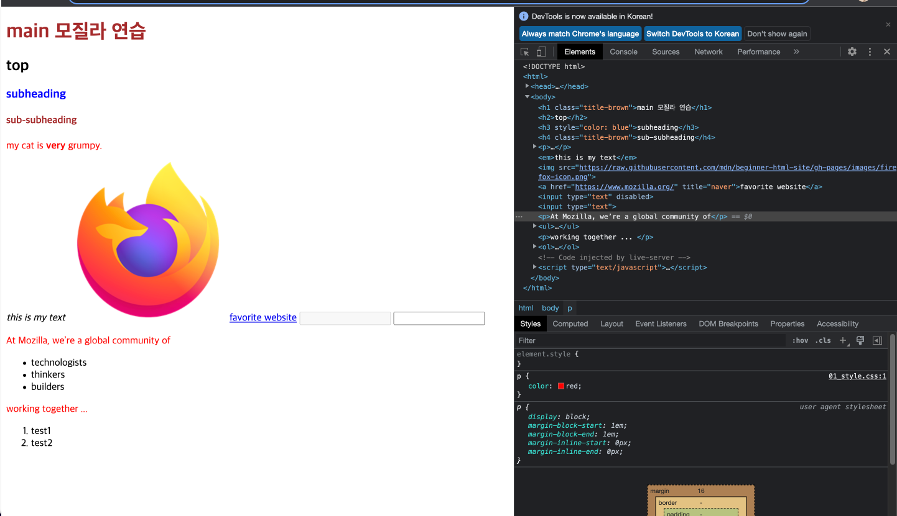

# HTML

---

## HTML이란? 

> 웹을 이루는 가장 기초적인 구성 요소
>
> 웹 콘텐츠의 의미와 구조를 정의할 떄 사용
>
> 해당 기술 이외의 다른 기술은 일반적으로 웹 페이지의 모양/표현(css) 또는 기능/동작(자바스크립트)를 설명하는데 사용

## 요소 

* ```html
  <head>
    
  </head>
  홈페이지 이용자에게는 보이지 않지만 검색 결과에 노출 될 키워드, 홈페이지 설명, css스타일등 html페이지의 모든 내용을 담고 있음
  ```

* ```html
  <tilte>
  </tilte>
  브라우저 탭에 표시되는 제목으로 사용
  ```

* ```html
  <body>
    
  </body>
  텍스트, 이미지, 비디오, 게임, 재생 가능한 오디오 트랙 등을 비롯하여 페이지에 표시되는 모든 콘텐츠가 포함 됨

```html
<header>
</header>
```

```html
<footer>
</footer>
```

```html
<article>
</article>
```

```html
<section>
</section>
```

```html
<p>
  
</p>
문장을 그냥 그 자체로 표시하는 경우
블록레벨 요소이므로, 각 요소들은 새로운 줄에 나타남
문단
```

```html
<div>
  
</div>
```

```html
<span>
</span>
```

```html

여는 태그, 닫는 태그가 아닌 단일 태그로 사용
해당 위치에 이미지를 삽입하기 위한 요소
```

```html
<aside>
</aside>
```

```html
<audio>
</audio>
```

```html
<canvas>
</canvas>
```

```html
<datalist>
</datalist>
```

```html
<details>
</details>
```

```html
<embed>
```

```html
<nav>
</nav>
```

```html
<output>
</output>
```

```html
<progress>
</progress>
```

```html
<video>
</video>
```

```html
<ul>
  
</ul>
순서없는 목록
```

```html
<ol>
  
</ol>
순서있는 목록
```

```html
<li>
</li>
목록의 각 항목은 해당 요소 안에 놓여야함
```

```html
<a>
</a>
텍스트를 감싸서 하이퍼링크로 만듬
여러 속성을 가질 수 있지만 아래에 있는 3개가 주로 사용
* href="https://www.mozilla.org/" : 이 속성에는 연결하고자 하는 웹 주소를 지정
* title: 링크에 대한 추가 정보를 나타냄, 링크 위로 마우스를 옮겼을 때 나타남
* target: 링크가 어떻게 열릴지를 결정, 새탭에서 보여줄지, 현재 탭에서 링크를 보여줄지(이 경우 이 속성 생략)
```

```html
<h1>
  
</h1>
제목 요소, 6단계의 제목을 갖고 아마 3-4를 주로 사용하게 될 것임
```


### 요소의 구조

* 여는 태그: 요소의 이름과 열고 다는 꺽쇠 괄호로 구성, 요소가 시작부터 효과가 적용
* 닫는 태그: 요소의 이름 앞에 슬래시가 있는 것을 제외하면 여는 태그와 같음
* 이것은 요소의 끝에 위치
* 내용: 요소의 내용이며, 단순 텍스트
* **요소: 여는 태그, 닫는 태그, 내용을 통틀어 요소라고 함**
* 블록 레벨 요소
  * 웹페이지 상에 블록을 만드는 요소
  * 앞 뒤 요소 사이에 새로운 줄을 만들고 나타냄
  * 요소 이전과 요소이후 요소사이의 줄을 바꿔줌
  * 볼록레벨 요소는 일반적으로 페이지의 구조적 요소를 나타낼 때 사용
  * 단락, 목록, 네비게이션 메뉴, 꼬리말등은 표현할 때 사용
  * 인라인 요소에 중첩 될 수 없지만 다른 블록레벨 요소에 중첩 될 수 있음
* 인라인 요소
  * 항상 블록레벨 요소 내에 포함되어있음
  * 한 단락같은 큰 범위에 적용 될 수 없고, 문장, 단어 같은 작은 부분에 대해서만 적용 될 수 있음
  * 인라인 요소는 새로운 줄을 만들지 않음 => 인라인 요소를 작성하면 그것을 작성한 단락 내에 나타게 됨
  * 인라인 요소에는 하이퍼링크를 정의하는 요소인`<a>` 텍스트를 강조하는 요소인 `<em>` `<strong>` 등이 있음

## 태그

* html `요소`는 태그를 사용해서 문서의 다른 텍스트와 구분함()
* 태그는 `<` , `>`로 이루어짐
* 태그 안의 요소이름은 대소문자 섞어서 작성 가능
* 웹 상의 다른 페이지로 이동하게하는 하이퍼링크 내용들을 생성하거나, 단어를 강조하는 등의 역할을 함


## 속성

* 속성은 요소에 실제로 나타내고 싶진 않지만 추가적인 내용을 담고 싶을 때 사용
* 나중에 스타일에 관련 된 내용이나, 기타 내용을 위해 해당 목표를 구분할 수 있는 `class` 속성 부여 가능
* 규칙
  * 요소 이름 다음에 오는 속성은 요소 이름과 속성 사이에 공백이 있어야 하고, 하나 이상의 속성들이 있는 경우엔 속성 사이에 공백이 있어야함
  * 속성 이름 다음엔 등호가 붙음
  * 속성 값은 열고 닫는 따옴표로 감싸야함


# [CSS](https://github.com/leejongeun2/Web/blob/master/01_web%EA%B8%B0%EC%B4%88.html)

---

> 작성 된 문서의 표시하는 방법을 기술하기 위한 스타일 시트 언어


## 정의방법

1. 해당 태크에 직접 style 속성을 활용 (바디)

   > 다만 해당 방법은 사용하지 않음, 왜냐, 하나하나씩 다해야 되서 관리가 안됨 / 유지보수, 재사용 가능성을 늘리기 위해

2. 헤드 태그 내에 스타일에 지정

   > H1{ color : }

3. 외부 css 파일을 불러오기

## 속성

* 주로 사용하는 속성이 있음
  * 폰트, 여백 등


✔️헤드에 작성 된 순으로 마지막 선언 된 것에 따라 감(같은 클래스인 경우, 나중 것이 적용 됨)

*