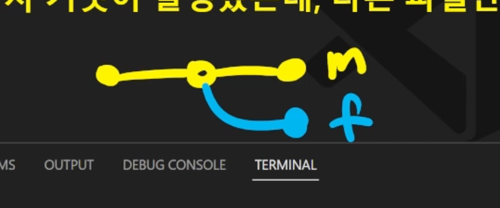
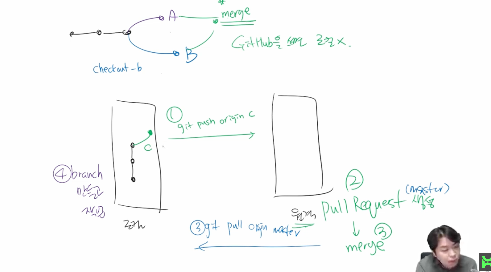

## 1. git : 분산버전관리 시스템

---

1. 파일작업
2. Add : 커밋할 파일 모으고, 임시공간으로 던짐
3. 커밋: 버전기록


## 2. 로컬

---

## <전체흐름>

1. 폴더 경로를 본다

   * 마스터 없는 것 확인!

2. Git 저장소로 버전관리 시작하기

   * git init 명령어 통해서 마스터 브랜치에 있다는 사실 알게 됨 
   * 폴더 경로에 .git 확인 됨

3. 파일만들기

4. 버전 만드는 중, 모든 자료조사 내용을 하나의 버전으로(여러 파일)

   * ```git status 로 확인
     * git status 로 확인 
     * git add . 여러 파일명 입력 
     * git status 
     * Git commit -m '자료조사'
     * 3개 뭉쳐저서 하나의 버전 만들어짐
     * git log
     ```

     

5. 보고서 파일 생성

   * 자료부족해 자료 파일 한개 더 생성(나무위키)
   * 🧐자료조사 보충, 보고서 생성 -> 버전 각각 생성 원하는 경우? 
     * git add. Namu.txt, git commit -m '자료조사 보충
     * git add. 보고서.txt, git commit '보고서 작성 완료'
     * Git log => **버전이 각각 나옴 (3개버전: 자료조사 보충, 보고서 작성 완료, 자료조사)**

🌠네이버 지식인 자료 파일 삭제 하는 경우? > 버전 삭제 

* git status 시, 빨간색 1통으로 삭제 된 것을 확인 가능 
* git add .
* git commit -m '네이버 지식인 자료 삭제'
* 현 상태 전체 스냅샷 찍어서 아카이빙

✔️커밋한 모든 내용은 다시 되돌릴 수 없음, 커밋하지 않은 모든 내용은 불가 

🌠보고서 파일 수정 된 경우 

=> 파일수정, 파일이름 바꾸든, 폴더이름 바꾸든 생성, 이동 원래 하던 대로 하고 커밋, 그리고 push

* 보고서 파일 수정 후 git status  찍어보면 수정 되었다는 modified가 노출
* **폴더 지우고 싶을 때, 로컬에서 해당하는 폴더를 지우고 커밋하고 푸쉬** 

🌠마크다운 이미지 경로 등 이슈 > 폴더나 파일을 이동시키면 타이포라에서 안보이는 경우가 당연, 경로가 바뀌었으니깐 

=> 


## 3. 11:00-12:00 원격저장소

---

```git
git push origin master
git pull origin master
```

* 원격저장소로 보내는 것이 push
* 받아오는 것은 Pull

✔️강사님의 til 을 받아서 쓰고 싶을때? 

* `Clone`  => 원격 저장소 이름의 폴더가 생성됨
  1. 명령어 복제 : git 저장소를 가져온 것임
  2. 다운로드 zip : 최신버전의 파일/폴더
* git pull origin master

?클론 받고 init 해야 되는지? > no

* pull > 커밋 받아옴(버전 받고 버전올리고)
* clone >저장소 받아옴

1. 저장소 만들기(로컬) git init

   > push

2. 깃헙에 원격 저장소 (초대받아서)

3. 조원은 github을 클론 받아옴


## 4. 13:00-14:00

---

📒학습목표: 브랜치 이해하기

📝 알고가기!

* ```1통에서 작업한 내용 `add` 임시공간 `커밋`해서 로컬```
* 로컬에서 `푸쉬, 풀`로 깃헙과 소통
* git add . => .은 현재 디렉토리 중 변경 된 파일들만 add 됨(status)```

* 마스터 코드: 사용자가 보는 화면 코드(기준점)

### 브랜치 목적

> 독립적인 버전들을 만들어나갈 수 있기 위해 > 브랜치 합치는 과정을 머지라고 함 

1. ```bash
   1. git init
   2. touch readme.md
    > add readme 
   3. Commit > 나무 뿌리
   4. git branch > 브랜치 가지 조회
   5. git branch example > 브랜치 생성
   6. git checkout examle > 브랜치 이동 > 브랜치 마스터에서 example로 변경 됨
   7. git status > 브랜치 이그잼플에서 파일 생성 후!
   8. git add .
   9. git commit
   
   ```

> Head : 머리, 가장 최근 커밋의 브랜치
> 마스터라는 브랜치로 head를 옮기면 첫번째 커밋만 보임 

### 가지합치기

```bash
git checkout master
git merge example > merge 사용 > 마스터에서 examle 합치기 
head -> master, examle

```

> git branch -d example > 브랜치 지우는 명령어
>
> 브랜치 지워도 마스터에 이미 합쳐놔서 상관 없음
>
> 개발 완료 되어서 합치면 합친 브랜치는 지워짐

### 브랜치로 발생할 수 있는 상황

🧘🏽브랜치,git, github =>협업하기 위함

ex) 보고서, 발표자료 제출 시 업무 배분

* 상황1: 보고서, 발표자리 다

  > 

* 상황2: 보고서, 발표자료 각각 수정하며 서로 다른 파일임

  >  조장은 조원이 받은 파일을 보고 편집/취합을 해야함 -> 각자 작업을 하면 수작업으로 고쳐야 함-

* 상황3: 보고서파트1, 보고서파트2, 발표자료 파트1, 발표자료 파트2

  > 서로 같은 파일 


상황3은 각각 파일 만들기? -> 다시보기!! 조별 과제 부분


## 5. 14:10~15:00

---

### 상황1. 혼자 작업하는 상황(조장이 다하는 상황)

- 홈 화면을 만든다. (Home.txt)

```bash
git branch feateure/home
git checkout feature/home >브랜치 변경 되었는지 눈으로 확인
git log
git log --oneline > 피처 브랜치에서는 두개 커밋있음
git checkout master > 마스터로 이동
git log --oneline > 마스터 내 한개 나옴 
git merge feature/home 
git log --oneline > 마스터이자 피처홈(마스터 브랜치)


```


### 상황2. 협업 시, 각 보고서 파일 + 발표자료 파일 (각 커밋이 발생했는데, 다른 파일만 수정 된 경우)



```bash
git branch -d 브랜치명 #브랜치 삭제
git checkout -b feature/about #브랜치 생성 및 이동
```


### 상황3. 진정한 협업(각자 커밋이 있는데 같은 파일이 수정 됨 )

커밋이 진행 된 적이 있는데, 마스터와 피쳐로 가지가 나눠짐 

✔️충돌 난 경우, 개발하는 방향에 맞게 고쳐야함, 같은 파일 수정 -> 충돌 부분 수정하고 커밋


## 6. 15:20-16:20

---

브랜치 병합은 보통 깃헙에서 진행 됨

깃헙 플로우 기본원칙

브랜치는 보통 기능의 이름을 입력 

1. 저장소 소유권 있는 경우: featuer

   ```bash
   git checkout -b hotfix #새로운 브랜치 생성
   git add .
   git commit -m 'readme hotfix'
   git push origin hotfix #git hub 가서 풀 리퀘스트 만들어라, 깃헙에 핫픽스 브랜치 생성 되어있음, 핫픽스 브랜치를 마스터에게 보내라, 풀리퀘스트 입력, 코멘트 입력, 머지 버튼생성
   ```

   > 로컬에서 브랜치 따서 개발, 푸쉬하면 원격으로 올라가고 원격에서 풀리퀘스트 만들고 마스터에 합쳐주세요. 
   >
   > Why? 여러 사용자들이 로컬에서 작업 후 원격에서 병합

2. 소유권 없는 경우 : Fork

   우측 상단 포크 누르고 만들면, 나의 저장소이긴한데, 포크가 되었다고 뜸

   ✔️편집하려면? 

   1. 저장소 링크 복사 
   2. 클론
   3. 파일 생성되면 vscode로 열기
   4. add, comit 하기
   5. git push origin main
      * origin 는 kdt(본인)것
   6. 풀 리퀘스트 보내기

   

   * share , full 권한이 있고, 없고의 차이

   

   ## 7. 16:10-17:00

   ---

   #### 실습

   * 수업후기 리드미에 넣기 > 바로 성공!

   

   ### Q. 여러개 파일 add 하고, 각 커밋을 나누고 싶을 때 > 다시보기

   * Git

   

   ### Q. 보고서 완성했으나, 밥먹고 왔을 때 다 사라졌을 때, 예전 버전으로 돌아가기 > 다시보기

   * Git restore a.txt > 이전에 버전으로 만들어놓았기 때문

   

   ✔️메세지 잘읽고 앞으로 나아가자! 

   ✔️명령어 최종정리

   

   

   ✔️모든 변경사항은 로컬에서 하고 커밋, push하는 습관을 갖자!

   ✔️이그노어 내 기록한 것은 git 이 무시함

   * 버전관리를 하지 안흔 파일/디렉토리가 발생하는데, 그걸 무시하는 것

   

   

   


