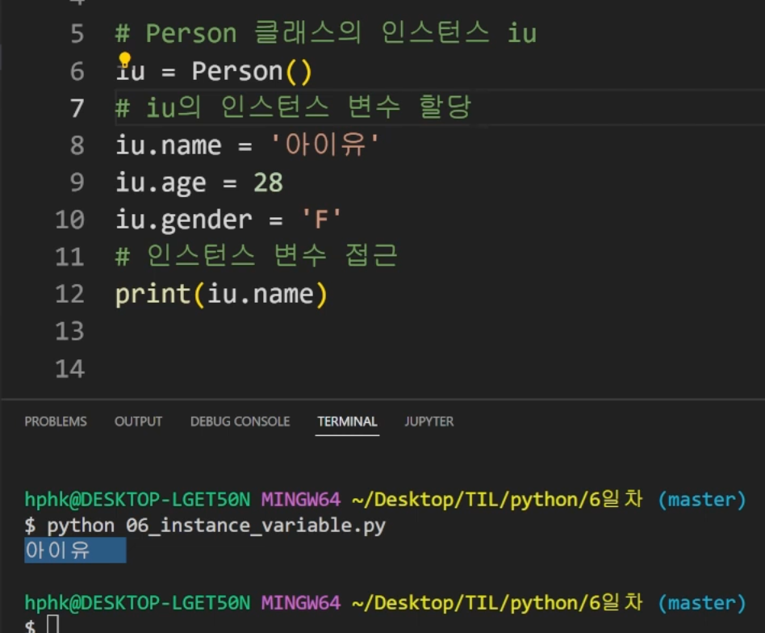

## 1교시 9:00 -10:00

---

### OOP

* 객체지향 프로그래밍

  > Object oriented program

* 파이썬은 모든 것이 객체

* 메서드는 타입이 주어가 되고, 행위가 동사가 됨

  * 어떤 타입이 있고 동작하게 됨

  * s.v()

## 2교시 10:00 - 11:00

---

* 클래스: 사각형
* 인스턴스: 각 사각형 r1, r2
* 속성: 사각형의 정보, 가로/세로 길이
* 사각형의 행동/기능 -메소드
  * 넓이를 구한다, 높이를 구한다 
* 각 인스턴스의 속성들을 메소드를 통해서 활용

## 3교시 11:00 - 12:00

---

* 알고리즘: 로직 설계
* 장고: 다른 분들이 만든 객체 활용

### oop 기초

* 클래스 생성
  * class My Class
  * 캐널 케이스: 중간에 대문자 -> 클래스
  * 스네이크 케이스: 다 소문자 -> 변수 또는 함수 
* 인스턴스 생성
* 메서드 호출
  * 클래스 내부에 정의 된 함수
* 속성
* 객체 비교하기 > 복습
  * 변수에 저장 되어있는 것은 메모리 주소, 객체에는 타입도 있고,,
  * 변수는 같지만 주소가 다를 수 있음
  * 얕은 복사는 메모리 주소값만 링크따오는 거고, 깊은 복사는 해당 데이터를 스냅샷 찍어서 카피 떠오는...! 
* 인스턴스 메소드
  * 인스턴스 조작을 위한 메서드
  * 호출 시, 첫번째 인자로 인스턴스 자기자신(self)이 전달 됨 
* self > 복습
  * 

* 맵은 반복 가능한 변경 된 모습
* 파이썬의 모든 것은 객체
  * 리시트.sort()
  * 클래스 class person
  * 인스턴스 iu = person()
  * 속성 iu.name => 속성 (변수)
  * Iu.greeting() => 메서드(함수)
    * self로 

