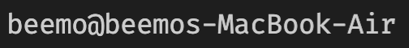
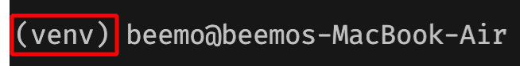
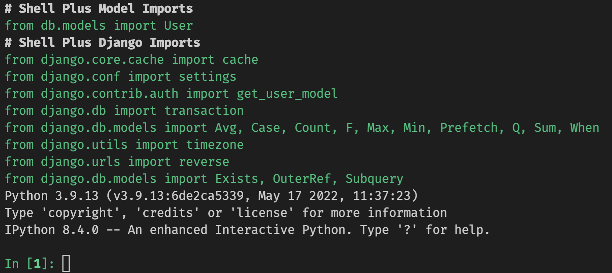

# [KDT] DB - ORM(Object Relational Mapping) 실습

## 목표
* ORM 이해
* Django Model 이해
* Django Queryset 이해
* 테이블 간 관계에 대한 이해와 Django에서의 관계 표현 방법

## 실습 환경 설정
| 아래 명령어는 모두 터미널에서 수행해주세요.
### 가상환경

* 생성
```bash
python -m venv venv
```

* 실행
    * windows
    ```bash
    . venv/Scripts/activate
    ```
    * mac
    ```zsh
    . venv/bin/activate
    ```

* 확인
    * 실행 전
    

    * 실행 후, `경로 위 혹은 왼쪽에 가상환경 이름 출력`
    

* 종료
```bash
deactivate
```
    
### 패키지 설치
| 아래의 모든 명령어는 가상환경을 실행한 상태로 진행하세요. 
* 가상환경 실행
   * windows
    ```bash
    . venv/Scripts/activate
    ```
    * mac
    ```zsh
    . venv/bin/activate
    ```
* pip install
```bash
pip install -r requirements.txt 
```

* django 패키지 설치 확인
```bash
python manage.py --version
# 4.0.6
```

### 모델 마이그레이션
```bash
python manage.py makemigrations

python manage.py migrate
```

### django shell
* shell 진입
```bash
python manage.py shell_plus
```

* 진입 확인



### 파일 실행
| 파일을 실행할 때에는 가상환경을 실행한 상태인지 꼭 확인합니다.
```bash
python main.py
```


## License
The MIT License (MIT) Copyright (c) 2022 Dan Caron

Permission is hereby granted, free of charge, to any person obtaining a copy of this software and associated documentation files (the "Software"), to deal in the Software without restriction, including without limitation the rights to use, copy, modify, merge, publish, distribute, sublicense, and/or sell copies of the Software, and to permit persons to whom the Software is furnished to do so, subject to the following conditions:

The above copyright notice and this permission notice shall be included in all copies or substantial portions of the Software.

THE SOFTWARE IS PROVIDED "AS IS", WITHOUT WARRANTY OF ANY KIND, EXPRESS OR IMPLIED, INCLUDING BUT NOT LIMITED TO THE WARRANTIES OF MERCHANTABILITY, FITNESS FOR A PARTICULAR PURPOSE AND NONINFRINGEMENT. IN NO EVENT SHALL THE AUTHORS OR COPYRIGHT HOLDERS BE LIABLE FOR ANY CLAIM, DAMAGES OR OTHER LIABILITY, WHETHER IN AN ACTION OF CONTRACT, TORT OR OTHERWISE, ARISING FROM, OUT OF OR IN CONNECTION WITH THE SOFTWARE OR THE USE OR OTHER DEALINGS IN THE SOFTWARE.


# 데이터베이스 07 - ORM

<aside>
💡 코드를 작성한 실습 파일을 압축해서 실라버스에 제출해주세요.


</aside>

### 1. `db/models.py` 파일에 아래의 모델 2개 `Director` `Genre` 를 작성하세요.

> 기본 코드

```python
class Director(models.Model):
    name = models.TextField()
    debut = models.DateTimeField()
    country = models.TextField()

class Genre(models.Model):
    title = models.TextField()
```

### 2. 모델을 마이그레이트(migrate) 하세요.

```bash
# 가상환경 실행 확인 후 아래 명령어를 터미널에 입력합니다.
python manage.py makemigrations

python manage.py migrate
```

### 3. Queryset 메소드 `create` 를 활용해서  `Director` 테이블에 아래 데이터를 추가하는 코드를 작성하세요.


| name            | debut      | country |
| --------------- | ---------- | ------- |
| 봉준호          | 1993-01-01 | KOR     |
| 김한민          | 1999-01-01 | KOR     |
| 최동훈          | 2004-01-01 | KOR     |
| 이정재          | 2022-01-01 | KOR     |
| 이경규          | 1992-01-01 | KOR     |
| 한재림          | 2005-01-01 | KOR     |
| Joseph Kosinski | 1999-01-01 | KOR     |
| 김철수          | 2022-01-01 | KOR     |

> 코드 작성

```python
# 1번
Director.objects.create(name='봉준호', debut='1993-01-01', country='KOR')
# 2번
director = Director()
In [10]: director.name = '김한민'

In [11]: director.debut = '1999-01-01'

In [12]: director.country = 'KOR'

In [13]: director.save()

#3번--벌크업로드 => 리스트 통한 반복문은 질문하기!
Director.objects.bulk_create([Director(name='이정재',debut='2022-01-01',country='
    ...: KOR'), Director(name='이경규', debut='1992-01-01', country='KOR'), Director(name=
    ...: '한재림', debut='2005-01-01', country='KOR'),])

directors = [
    ("봉준호","1993-01-01","KOR"),
    ("김한민","1999-01-01","KOR"),
    ("최동훈","2004-01-01","KOR"),
    ("이정재","2022-01-01","KOR"),
    ("이경규","1992-01-01","KOR"),
    ("한재림","2005-01-01","KOR"),
    ("Joseph Kosinski","1999-01-01","KOR"),
    ("김철수","2022-01-01","KOR"),
]

for director in directors:
    name_ = director[0]
    debut_ = director[1]
    country_ = director[2]
    Director.objects.create(name=name_,debut=debut_,country=country_)

```

### 4. `인스턴스 조작` 을 활용하여`Genre` 테이블에 아래 데이터를 추가하는 코드를 작성하세요.

| title  |
| ------ |
| 액션   |
| 드라마 |
| 사극   |
| 범죄   |
| 스릴러 |
| SF     |
| 무협   |
| 첩보   |
| 재난   |

> 코드 작성

```python
In [60]: genre = Genre()

In [61]: genre.title = '액션'

In [62]: genre.save()

In [63]: genre = Genre()

In [64]: genre.title = '드라마'

In [65]: genre.save()

In [66]: genre = Genre()

In [67]: genre.title = '사극'

In [68]: genre.save()

In [69]: genre = Genre()

In [70]: genre.title = '범죄'

In [71]: genre.save()

In [72]: genre = Genre()

In [73]: genre.title = '스릴러'

In [74]: genre.save()

In [75]: genre = Genre()

In [76]: genre.title = 'SF
  Input In [76]
    genre.title = 'SF
                  ^
SyntaxError: unterminated string literal (detected at line 1)


In [77]: genre.title = 'SF'

In [78]: genre.save()

In [79]: genre = Genre()

In [80]: genre.title = '무협'

In [81]: genre.save()

In [82]: genre = Genre()

In [83]: genre.title = '첩보'

In [84]: genre.save()

In [85]: genre = Genre()

In [86]: genre.title = '재난'

In [87]: genre.save()


genres = ["액션","드라마","사극","범죄","스릴러","SF","무협","첩보","재난"]
for title_ in genres:
    genre = Genre()
    genre.title = title_
    genre.save()
```

### 5. Queryset 메소드 `all` 을 활용해서 `Director` 테이블의 모든 데이터를 출력하는 코드를 작성하세요.

> 출력 예시

```
봉준호 1993-01-01 00:00:00 KOR
김한민 1999-01-01 00:00:00 KOR
최동훈 2004-01-01 00:00:00 KOR
이정재 2022-01-01 00:00:00 KOR
이경규 1992-01-01 00:00:00 KOR
한재림 2005-01-01 00:00:00 KOR
Joseph Kosinski 1999-01-01 00:00:00 KOR
김철수 2022-01-01 00:00:00 KOR
```

> 코드 작성

```python
director = Director.objects.all()

In [123]: for direc in director:
     ...:     print(direc.name, direc.debut, direc.country)
```

### 6. Queryset 메소드 `get` 을 활용해서 `Director` 테이블에서 `id` 가 1인 데이터를 출력하는 코드를 작성하세요.

> 출력 예시

```
봉준호 1993-01-01 00:00:00 KOR
```

> 코드 작성

```python
director = Director.objects.get(id=1)
print(director.name,director.debut,director.country)

```

### 7. Queryset 메소드 `get` 을 활용해서 `Director` 테이블에서 `country` 가 USA인 데이터를 출력하는 코드를 작성하세요.

> 코드 작성

```python
director = Director.objects.get(country='USA')
```

### 8. 위 문제에서 오류가 발생합니다. 출력된 오류 메세지와 본인이 생각하는 혹은 찾은 오류가 발생한 이유를 작성하세요.

> 오류 메세지

```bash
DoesNotExist: Director matching query does not exist.
```

> 이유 작성

```
조회한 usa와 일치하는 데이터가 없어서 
```

### 9. Queryset 메소드 `get` 과 `save` 를 활용해서 `Director` 테이블에서  `name` 이 Joseph Kosinski인 데이터를 조회해서 `country` 를 USA 로 수정하고, 출력하는 코드를 작성하세요.

> 출력 예시

```
Joseph Kosinski 1999-01-01 00:00:00 USA
```

> 코드 작성

```python
director = Director.objects.get(name='Joseph Kosinski')
director.country = 'USA'
director.save()
print(director.name,director.debut,director.country)
```

### 10. Queryset 메소드 `get` 을 활용해서 `Director` 테이블에서 `country` 가 KOR인 데이터를 출력하는 코드를 작성하세요.

> 코드 작성

```python
director = Director.objects.get(country = 'KOR')
print(director.name,director.debut,director.country)
```

### 11. 위 문제에서 오류가 발생합니다. 출력된 오류 메세지와 본인이 생각하는 혹은 찾은 오류가 발생한 이유를 작성하세요.

> 오류 메세지

```bash
get() returned more than one Director -- it returned 7!
```

> 이유 작성

```
kor인 데이터는 7개이므로, 둘 이상의 데이터를 반환해서 그런 경우 필터를 써야함(즉, pk처럼 고유 값이 아니므로)
```

### 12. Queryset 메소드 `filter` 를 활용해서 `Director` 테이블에서 `country` 가 KOR인 데이터를 출력하는 코드를 작성하세요.

> 출력 예시

```
봉준호 1993-01-01 00:00:00 KOR
김한민 1999-01-01 00:00:00 KOR
최동훈 2004-01-01 00:00:00 KOR
이정재 2022-01-01 00:00:00 KOR
이경규 1992-01-01 00:00:00 KOR
한재림 2005-01-01 00:00:00 KOR
김철수 2022-01-01 00:00:00 KOR
```

> 코드 작성

```python
director = Director.objects.filter(country = 'KOR')

In [113]: for direc in director:
     ...:     print(direc.name, direc.debut, direc.country)
```

### 13. 본인이 생각하는 혹은 찾은 `get` 과 `filter` 의 차이를 작성하세요.

```
* get 은 한개의 값만 반환, 리스트로 패킹 안되어있음, 단일객체, 없거나 많으면 오류띄움, 프라이머리키 바탕으로 찾을 때
* filter는 전일객체, 리스트로 패킹, 무조건 결과가 쿼리셋, 나머지 모두는 필터 쓰면 됨
```

### 14. Queryset 메소드 `get` 과 `delete`를 활용해서  `Director` 테이블에서 `name` 이 김철수인 데이터를 삭제하는 코드를 작성하세요.

> 코드 작성
```python
director = Director.objects.get(name="김철수")
director.delete()
```