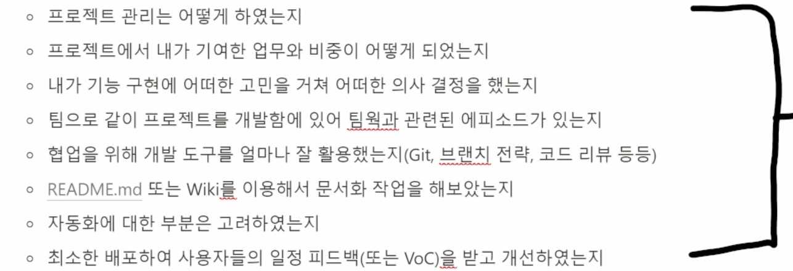
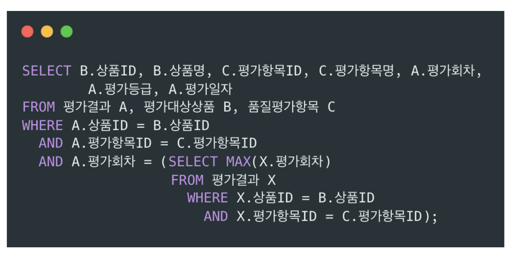

## 학습 Q&A

---

✔️개념학습(개인학습 이론공부후 문제풀이...)
-재귀
-DFS/BFS
-트리
-DP
-그리디
-최단거리
-백트래킹

✔️ SWEA4, 프로그래머스lv3, 백준 골드3 목표!!

✔️ 코딩테스트 취업 될 때까지!!

✔️ 문제풀이 열심히! => 많이 풀면 문제가 쉬워짐

✔️데이터분석에 관심이 있다면 pandas, numpy 추가 공부

동시에 작업 후 이어붙이는 것이 pr, 기능만들고 pr, 

### 취업

* 포트폴리오, 코테, 서류 및 면접
* 지금은 코테가 가장 필요함

### 프로젝트

* 필수기능하고 완성시킨 다음에 추가기능
* 마지막에 배포까지하면 좋음
* 포트폴리오는 어떤 하나의 프로젝트를 완성하며 결정했던 것들이 모인 의사결정의 집합 => why 들의 집합
* 

### 오후는 TEST

13:25-14:30 : 데이터베이스 구글폼 평가

14:50-17:30 : 프로그래머스 데이터베이스 평가

### 틀린 문제

15. 데이터 모델에서 **평가대상상품**에 대한 **품질평가 항복**별 **최종 평가결과**를 추출하는 SQL 문장으로 옳은것은?
    (단, 평가항목에 대한 평가등급이 기대수준이 미치지 못할 경우 해당 평가항목에 대해서만 재평가를 수행한다.)

